## StargatePool.sol Breakdown

### Description

`StargatePool.sol` is a concrete implementation within the Stargate protocol, designed specifically for creating and managing liquidity pools for ERC20 tokens. It inherits from the abstract `StargateBase` contract, thereby leveraging the core cross-chain messaging, fee handling, and path management functionalities provided by its parent. `StargatePool` extends this base by adding features specific to ERC20 token pooling, primarily centered around the minting and burning of LP (Liquidity Provider) tokens to represent users' shares in the pool.

**Key Functionalities:**

*   **LP Token Management:**
    *   **Creation and Management:** Upon deployment, `StargatePool` creates a new `LPToken` instance (an ERC20 token itself). The address of this LP token is stored in the `lp` state variable. This `LPToken` is used to track each user's contribution to the pool.
    *   **`deposit(uint256 _amountLD, address _to)`:** This function allows users to deposit a specified amount (`_amountLD`) of the pool's underlying ERC20 token. In return, the contract mints a corresponding amount of `LPToken`s to the specified recipient address (`_to`). The amount of LP tokens minted is proportional to the amount of underlying tokens deposited relative to the total value locked (TVL) in the pool.
    *   **`redeem(uint256 _amountLPT, address _to)`:** Users can call this function to burn a specified amount (`_amountLPT`) of their `LPToken`s. In exchange, they receive a proportional amount of the underlying ERC20 token from the pool, sent to the recipient address (`_to`).
    *   **`redeemSend(uint32 _dstEid, bytes calldata _to, uint256 _amountLPT, uint256 _minAmountSD, MessagingFee calldata _fee)`:** This function combines redeeming LP tokens with initiating a cross-chain transfer. Users specify the amount of LP tokens (`_amountLPT`) to redeem. The underlying ERC20 tokens are then withdrawn from the pool and immediately sent to a specified destination chain (`_dstEid`) and recipient (`_to`) using the "Taxi" mode of `StargateBase`. It includes parameters for minimum received amount (`_minAmountSD`) and messaging fees (`_fee`).
    *   **`redeemable(address _owner, uint256 _amountLPT)`:** A view function that calculates the amount of underlying ERC20 tokens a user (`_owner`) would receive if they were to redeem a specific amount (`_amountLPT`) of LP tokens. This helps users preview the outcome of a redemption.

*   **Liquidity Metrics:**
    *   **`tvlSD` (Total Value Locked in Shared Decimals):** A state variable that tracks the total value of the underlying ERC20 tokens locked in the pool, represented in Stargate's shared decimal format (8 decimals). The public view function `tvl()` returns this value.
    *   **`poolBalanceSD`:** This state variable represents the actual amount of the underlying ERC20 token currently held by the `StargatePool` contract, also in shared decimals. The public view function `poolBalance()` returns this value. `poolBalanceSD` can be less than `tvlSD` if some portion of the TVL is currently allocated as credits to other chains.
    *   **`deficitOffsetSD`:** A configurable value (set by the `planner` role) used to adjust the "ideal" or target liquidity for the pool when calculating path deficits. This can influence fee calculations, effectively making it cheaper or more expensive to transfer out of a pool based on its current liquidity relative to this adjusted ideal.

*   **Fee Overrides/Implementations (Hooks from `StargateBase`):**
    *   **`_capReward(uint32, uint256 _amountSD, address)`:** This internal function implements the reward capping logic. In `StargatePool`, it typically ensures that rewards or the amount transferred out does not unfairly dilute the pool for existing LPs, often by considering the `treasuryFee` or ensuring the amount doesn't exceed available pool balance.
    *   **`_inflow(uint256 _amountLD, address _from)`:** This hook is called when ERC20 tokens enter the contract (e.g., during a `deposit` or when receiving tokens from another chain via `lzReceive`). It's responsible for executing the actual `IERC20(_token).transferFrom(_from, address(this), _amountLD)` to pull tokens into the pool.
    *   **`_outflow(uint256 _amountLD, address _to)`:** This hook is called when ERC20 tokens leave the contract (e.g., during a `redeem` or when sending tokens to another chain). It executes `IERC20(_token).transfer(_to, _amountLD)` to send tokens from the pool.
    *   **`_postInflow(uint256 _amountSD, address)`:** Called after tokens have flowed into the pool. It updates the `poolBalanceSD` by increasing it and also increases the local path's credit (`paths[localEid()].credits`) to reflect the newly available liquidity.
    *   **`_postOutflow(uint256 _amountSD, address)`:** Called after tokens have flowed out of the pool. It updates the `poolBalanceSD` by decreasing it.
    *   **`_buildFeeParams(uint32 _dstEid, ...)`:** This function constructs the parameters required by the `IStargateFeeLib` for fee calculation. Notably, it includes the `deficitSD` for the destination path, which is calculated based on the `paths[_dstEid].balance` relative to an ideal share of the `tvlSD` (potentially adjusted by `deficitOffsetSD`). This deficit influences the fee, making transfers to chains with lower relative liquidity potentially more expensive.

*   **Type Identification:**
    *   `stargateType()`: A view function that returns `StargateType.Pool` (an enum value), allowing external contracts or interfaces to identify this contract as an ERC20 token pool.

**Key State Variables:**

*   `lp`: The address of the `LPToken` contract associated with this pool.
*   `tvlSD`: Total value locked in the pool, in shared decimals.
*   `poolBalanceSD`: Current balance of the underlying ERC20 token held by the pool, in shared decimals.
*   `deficitOffsetSD`: An offset used in calculating path deficits for fee purposes.

**Key Events:**

*   `Deposited(address indexed user, uint256 amountLD, uint256 amountLPT, address indexed to)`: Emitted when a user successfully deposits ERC20 tokens and receives LP tokens.
*   `Redeemed(address indexed user, uint256 amountLPT, uint256 amountLD, address indexed to)`: Emitted when a user successfully redeems LP tokens for underlying ERC20 tokens.
*   (Inherits events from `StargateBase` like `OFTSent`, `OFTReceived`, etc.)

**Constructor:**

The constructor for `StargatePool` typically takes parameters necessary to initialize both itself and its `StargateBase` parent, as well as the `LPToken`. Key parameters include:
*   `_endpoint`, `_localEid`, `_token`, `_sharedDecimals`, `_localDecimals`, `_feeLib`, `_treasury`, `_tokenMessaging`, `_creditMessaging`: For `StargateBase` initialization.
*   `_lpTokenName`, `_lpTokenSymbol`: For naming the `LPToken` that will be created and managed by this pool.
*   `_owner`, `_planner`, `_treasurer`: Initial role assignments.

### Diagram

```mermaid
graph TD;
    %% Core Contracts
    SG_Base["StargateBase (Abstract)"]
    SG_Pool["StargatePool (ERC20 Pool)"]
    LP_Token["LPToken (ERC20 for Liquidity Provision)"]

    %% Inheritance
    SG_Pool --inherits from--> SG_Base

    %% Composition / Management
    SG_Pool --creates & manages--> LP_Token

    subgraph User_Interactions_Pool ["User Interactions with StargatePool"]
        direction TB
        UserDeposit["User calls deposit()"] --> SG_Pool
        UserRedeem["User calls redeem()"] --> SG_Pool
        UserRedeemSend["User calls redeemSend()"] --> SG_Pool
        UserCheckRedeemable["User calls redeemable()"] --> SG_Pool
    end

    subgraph LP_Token_Operations ["LP Token Operations"]
        direction TB
        LPMint["LPToken.mint(to, amount)"]
        LPBurn["LPToken.burnFrom(from, amount)"]
    end

    %% Functional Flows
    UserDeposit -- "triggers" --> SG_Pool_Deposit_Logic["StargatePool: deposit() logic"]
    SG_Pool_Deposit_Logic -- "_inflow() token transfer" --> SG_Pool
    SG_Pool_Deposit_Logic -- "_postInflow() updates poolBalance/path credits" --> SG_Pool
    SG_Pool_Deposit_Logic -- "mints LP tokens" --> LPMint
    LPMint --> LP_Token


    UserRedeem -- "triggers" --> SG_Pool_Redeem_Logic["StargatePool: redeem() logic"]
    SG_Pool_Redeem_Logic -- "burns LP tokens" --> LPBurn
    LPBurn --> LP_Token
    SG_Pool_Redeem_Logic -- "_outflow() token transfer" --> SG_Pool
    SG_Pool_Redeem_Logic -- "_postOutflow() updates poolBalance" --> SG_Pool

    UserRedeemSend -- "triggers" --> SG_Pool_RedeemSend_Logic["StargatePool: redeemSend() logic"]
    SG_Pool_RedeemSend_Logic -- "burns LP tokens" --> LPBurn
    SG_Pool_RedeemSend_Logic -- "_outflow() token transfer (to self temporarily)" --> SG_Pool
    SG_Pool_RedeemSend_Logic -- "initiates cross-chain send" --> SG_Base_SendLogic["StargateBase: sendToken() via _taxi()"]
    SG_Base_SendLogic --> SG_Base


    %% Reliance on StargateBase
    SG_Pool -- "relies on for core OFT send/receive" --> SG_Base
    SG_Pool -- "relies on for fee calculation structure" --> SG_Base
    SG_Pool -- "relies on for LayerZero messaging" --> SG_Base
    SG_Pool -- "relies on for path/credit management" --> SG_Base

    %% Overridden Hooks
    subgraph Base_Hooks_Implemented_By_Pool ["StargateBase Hooks Implemented/Overridden"]
        direction TB
        Hook_capReward["_capReward()"]
        Hook_inflow["_inflow()"]
        Hook_outflow["_outflow()"]
        Hook_postInflow["_postInflow()"]
        Hook_postOutflow["_postOutflow()"]
        Hook_buildFeeParams["_buildFeeParams()"]
    end
    SG_Pool -- "implements" --> Hook_capReward
    SG_Pool -- "implements" --> Hook_inflow
    SG_Pool -- "implements" --> Hook_outflow
    SG_Pool -- "implements" --> Hook_postInflow
    SG_Pool -- "implements" --> Hook_postOutflow
    SG_Pool -- "implements" --> Hook_buildFeeParams


    classDef abstract fill:#f9f,stroke:#333,stroke-width:2px;
    class SG_Base abstract;
```

