## StargatePoolNative.sol Breakdown

### Description

`StargatePoolNative.sol` is a specialized contract within the Stargate protocol designed to create and manage liquidity pools for native blockchain assets (e.g., ETH on Ethereum, BNB on BNB Chain, AVAX on Avalanche). It inherits from `StargatePool.sol`, which in turn inherits from `StargateBase.sol`. This inheritance structure allows `StargatePoolNative` to reuse the vast majority of the ERC20 pooling logic (like LP token management via `deposit()`, `redeem()`) and the core cross-chain functionalities (messaging, fee structures, path management) from its parent contracts.

The primary purpose of `StargatePoolNative` is to adapt these inherited functionalities to the nuances of handling native assets, which are not ERC20 tokens and are primarily transferred via `msg.value` and direct address transfers rather than `transferFrom()` and `transfer()`.

**Key Overrides and Differences from `StargatePool`:**

*   **Constructor:**
    *   While it receives `_tokenDecimals` (e.g., 18 for ETH) and `_sharedDecimals` (typically 8 for Stargate) like `StargatePool`, the crucial difference is that the `token` address within the underlying `StargateBase` is effectively set to `address(0)` (or a similar sentinel indicating a native asset, depending on the specific Stargate implementation details). This informs `StargateBase` and other parts of the system that it's dealing with the chain's native currency.

*   **`_inflow(uint256 _amountLD, address)` override:**
    *   This function is fundamentally different from its `StargatePool` counterpart. Instead of performing an `IERC20.transferFrom()`, it relies on the native asset being sent with the transaction itself (`msg.value`).
    *   The `_amountLD` parameter is typically expected to match `msg.value` during a native asset deposit. The inherited `deposit()` function from `StargatePool` would call this, and `_assertMsgValue()` ensures this consistency.
    *   No actual token transfer call is needed here as the value is already in the contract's balance due to `msg.value`.

*   **`_outflow(uint256 _amountLD, address payable _to)` override:**
    *   Handles the transfer of native assets out of the contract.
    *   It uses a utility function, often `Transfer.transferNative()`, to send `_amountLD` of the native asset to the recipient address `_to`.
    *   This version of outflow typically includes a gas limit for the transfer to prevent reentrancy issues where the recipient could hijack execution.

*   **`_safeOutflow(uint256 _amountLD, address payable _to)` override:**
    *   Similar to `_outflow`, but designed for operations like `redeem()` where the user is withdrawing their own funds and a fixed gas limit might be too restrictive or cause legitimate transfers to fail (e.g., to a complex fallback contract).
    *   It also uses `Transfer.transferNative()` but generally without imposing a strict gas limit on the external call, or with a much higher one.

*   **`_assertMessagingFee(uint256 _messagingFee, uint256 _amountInLD)` override:**
    *   When sending native assets cross-chain, the `msg.value` sent to LayerZero (or the Stargate messaging layer) must cover both the `_messagingFee` (for LayerZero) *and* the actual `_amountInLD` of the native asset being transferred.
    *   This override ensures that `msg.value == _messagingFee + _amountInLD`. In contrast, for ERC20 tokens, `msg.value` only needs to cover `_messagingFee`, as the tokens are pulled via `transferFrom`.

*   **`_assertMsgValue(uint256 _amountLD)` override (within `deposit` context):**
    *   Specifically for the `deposit()` flow inherited from `StargatePool`, this internal check (often called at the beginning of `deposit`) ensures that `msg.value` sent by the user is exactly equal to `_amountLD` (the amount of native asset they intend to deposit). This prevents discrepancies.

*   **`_thisBalance()` override:**
    *   Returns `address(this).balance`, providing the current native asset balance of the `StargatePoolNative` contract. This is used in various calculations where the pool's own token holdings are needed, contrasting with `_token.balanceOf(address(this))` in an ERC20 context.

*   **`_plannerFee()` override:**
    *   Calculates the fee available for the `planner` role. For native pools, this is often based on `address(this).balance` minus the `poolBalanceSD` (converted to local decimals) and `tvlSD` (if different due to credits), representing surplus native assets not part of the core liquidity or TVL.

*   **`fallback()` and `receive()` functions:**
    *   These are standard Solidity payable functions that allow a contract to receive native currency directly.
    *   In the context of `StargatePoolNative`, these are often marked `payable`. The provided codebase snippets sometimes show them as `onlyOwner`. This implies they are not the primary mechanism for user deposits (which would go through the inherited `deposit()` function from `StargatePool` that correctly handles LP minting). Instead, an `onlyOwner` `fallback`/`receive` would be for administrative purposes, like the owner directly topping up the contract's native balance for operational reasons or initial seeding, bypassing the LP minting logic.
    *   The primary user deposit flow still uses the `deposit()` function from `StargatePool`, which, due to the overridden `_inflow` and `_assertMsgValue`, correctly handles `msg.value` for native assets.

**Reused Functionality:**

`StargatePoolNative` extensively reuses the higher-level logic from `StargatePool` and `StargateBase`:
*   **LP Token Management:** `deposit()`, `redeem()`, `redeemSend()` (though `redeemSend`'s native asset transfer part is handled by overridden outflows), and `LPToken` creation/minting/burning logic are inherited directly from `StargatePool`.
*   **Cross-Chain Messaging:** The core `sendToken()` logic, interaction with `LayerZeroEndpoint`, `ITokenMessaging`, and `ICreditMessaging` are inherited from `StargateBase`. The overrides like `_assertMessagingFee` ensure these adapt correctly to native asset transfers.
*   **Fee Calculation:** The structure for quoting and charging fees using `IStargateFeeLib` is inherited. Overrides like `_buildFeeParams` might have minor adjustments if native asset specifics influence fee parameters.
*   **Path and Credit Management:** Logic for `paths`, `sendCredits`, `receiveCredits` is inherited.
*   **Role-Based Access Control & State Management:** Inherited directly.

In essence, `StargatePoolNative` acts as a crucial adapter layer, tweaking the low-level token interaction points (`_inflow`, `_outflow`) to use native asset mechanics (`msg.value`, direct transfers) while preserving the sophisticated pooling and cross-chain infrastructure of its parent contracts.

### Diagram

```mermaid
graph TD;
    %% Core Contracts Hierarchy
    SG_Base["StargateBase (Abstract)"]
    SG_Pool["StargatePool (ERC20 Pooling Logic)"]
    SG_PoolNative["StargatePoolNative (Native Asset Adapter)"]

    %% Inheritance Links
    SG_Pool --inherits from--> SG_Base
    SG_PoolNative --inherits from--> SG_Pool

    %% Key Characteristics of StargatePoolNative
    subgraph NativeAssetSpecifics ["Native Asset Specifics in StargatePoolNative"]
        TokenAddress["token = address(0) (in StargateBase context)"]
        MsgValueHandling["Handles native assets via msg.value"]
    end
    SG_PoolNative -- characterized by --> TokenAddress
    SG_PoolNative -- characterized by --> MsgValueHandling

    %% Overridden Functions in StargatePoolNative
    subgraph Overridden_Functions ["Key Overridden Functions by StargatePoolNative"]
        direction TB
        Override_Inflow["_inflow() <br> (handles msg.value, no transferFrom)"]
        Override_Outflow["_outflow() <br> (uses Transfer.transferNative with gas limit)"]
        Override_SafeOutflow["_safeOutflow() <br> (uses Transfer.transferNative, less restrictive gas)"]
        Override_AssertMessagingFee["_assertMessagingFee() <br> (msg.value = fee + amountLD)"]
        Override_AssertMsgValue["_assertMsgValue() <br> (ensures msg.value == deposit amountLD)"]
        Override_ThisBalance["_thisBalance() <br> (returns address(this).balance)"]
        Override_PlannerFee["_plannerFee() <br> (calculates based on address(this).balance)"]
        PayableFallback["payable fallback()/receive() <br> (e.g., onlyOwner for admin top-ups)"]
    end

    SG_PoolNative -- "overrides StargatePool's version" --> Override_Inflow
    SG_PoolNative -- "overrides StargatePool's version" --> Override_Outflow
    SG_PoolNative -- "overrides StargatePool's version" --> Override_SafeOutflow
    SG_PoolNative -- "overrides StargateBase's version" --> Override_AssertMessagingFee
    SG_PoolNative -- "overrides StargatePool's version" --> Override_AssertMsgValue
    SG_PoolNative -- "overrides StargatePool's version" --> Override_ThisBalance
    SG_PoolNative -- "overrides StargatePool's version" --> Override_PlannerFee
    SG_PoolNative -- "implements" --> PayableFallback


    %% Inherited Functionality (Conceptual)
    subgraph Inherited_Functionality ["Inherits Most Logic From"]
        direction TB
        Inherited_LP_Mgmt["LP Token Management (deposit, redeem, LP mint/burn)"]
        Inherited_XChain_Msg["Core Cross-Chain Messaging (sendToken, lzReceive)"]
        Inherited_Fee_Logic["Fee Calculation Structure"]
        Inherited_Path_Credit["Path & Credit Management"]
    end
    SG_PoolNative -- "reuses" --> Inherited_LP_Mgmt
    Inherited_LP_Mgmt -- "from" --> SG_Pool

    SG_PoolNative -- "reuses" --> Inherited_XChain_Msg
    Inherited_XChain_Msg -- "from" --> SG_Base

    SG_PoolNative -- "reuses" --> Inherited_Fee_Logic
    Inherited_Fee_Logic -- "from" --> SG_Base

    SG_PoolNative -- "reuses" --> Inherited_Path_Credit
    Inherited_Path_Credit -- "from" --> SG_Base

    classDef abstract fill:#f9f,stroke:#333,stroke-width:2px;
    class SG_Base abstract;
```

