# Stargate Protocol: Comprehensive Analysis and Documentation

## 1. Architectural Overview
<!-- Content from stargate_architecture.md will be inserted here -->
**Architectural Overview**

The Stargate protocol is a cross-chain liquidity transport protocol designed to facilitate the transfer of tokens and native assets between different blockchain networks. It enables users to seamlessly move assets from one chain to another without the need for traditional bridging mechanisms that often involve wrapping and unwrapping tokens. Stargate achieves this by leveraging the underlying messaging capabilities of the LayerZero protocol, which provides a generic and reliable inter-chain communication layer.

At its core, the Stargate protocol is built around a set of smart contracts that manage liquidity pools and coordinate cross-chain transfers. Key components identified from the codebase include:

*   **`StargateBase`**: This is an abstract contract that serves as the foundation for other Stargate contracts. It encapsulates common logic and functionalities shared across different pool types, such as interacting with LayerZero, fee libraries, and messaging systems.
*   **`StargatePool`**: This contract inherits from `StargateBase` and is specifically designed for managing pools of ERC20 tokens. It handles deposits, withdrawals, and the initiation of cross-chain token transfers for standard ERC20 assets.
*   **`StargatePoolNative`**: Also inheriting from `StargateBase` (indirectly through `StargatePool` in some implementations, or directly depending on the specific version), this contract is tailored for managing pools of native blockchain assets (e.g., ETH, BNB). It allows users to transfer native currencies across chains.
*   **`LayerZero Endpoint`**: This is an external contract, provided by LayerZero, that `StargateBase` interacts with to send and receive messages across different blockchains. It is the fundamental communication backbone for Stargate.
*   **`Fee Library` (`IStargateFeeLib`)**: An external contract interface that `StargateBase` utilizes to calculate the fees associated with cross-chain transfers. This library determines the cost for users to move assets through the Stargate protocol.
*   **`Token Messaging` (`ITokenMessaging`)**: An external contract interface used by `StargateBase` for the actual sending and receiving of token payloads. This system often includes different modes or strategies for message delivery, sometimes referred to as "Taxi" or "Bus" modes, optimizing for speed or cost.
*   **`Credit Messaging` (`ICreditMessaging`)**: An external contract interface that `StargateBase` interacts with to manage cross-chain credits and path liquidity. This system is crucial for ensuring that there is enough liquidity on the destination chain to fulfill a transfer request initiated from a source chain.
*   **`Path Library` (`Path.sol`)**: This internal library contains the logic for managing liquidity paths and credits within the Stargate protocol. It works in conjunction with `ICreditMessaging` to determine optimal routes and ensure sufficient liquidity for transfers.
*   **`LPToken`**: A utility token (typically an ERC20 token) that is minted to users when they provide liquidity to a `StargatePool` or `StargatePoolNative`. These tokens represent the provider's share in the liquidity pool and can be staked or redeemed.

A notable concept within Stargate is the distinction between **shared decimals (SD)** and **local decimals (LD)**. Shared decimals refer to a standardized decimal representation used within the Stargate protocol for accounting and interoperability, while local decimals refer to the native decimal precision of a token on its specific blockchain. The protocol handles conversions between these two decimal systems to ensure accurate value transfer across chains with potentially different token decimal standards.

**Diagram**

```mermaid
graph TD;
    subgraph Stargate Protocol Core
        StargateBase[StargateBase (Abstract)]
        StargatePool[StargatePool (ERC20)]
        StargatePoolNative[StargatePoolNative (Native Assets)]
        LPToken[LPToken (Utility)]
        PathLib[Path.sol (Internal Library)]
    end

    subgraph External Systems
        LayerZeroEndpoint[LayerZero Endpoint]
        IStargateFeeLib[IStargateFeeLib (Fee Calculation)]
        ITokenMessaging[ITokenMessaging (Token Send/Receive)]
        ICreditMessaging[ICreditMessaging (Cross-chain Credits)]
    end

    %% Inheritance
    StargatePool --inherits--> StargateBase
    StargatePoolNative --inherits--> StargatePool %% Or directly from StargateBase, common to see it via StargatePool

    %% Interactions with Core Contracts
    StargatePool --> LPToken
    StargatePoolNative --> LPToken %% Native pools also use LPTokens

    %% StargateBase Interactions with External Systems
    StargateBase --> LayerZeroEndpoint
    StargateBase --> IStargateFeeLib
    StargateBase --> ITokenMessaging
    StargateBase --> ICreditMessaging

    %% Internal Logic Interactions
    StargateBase --> PathLib %% Path.sol logic is used by StargateBase or contracts inheriting it
    PathLib -.uses.-> ICreditMessaging %% PathLib interacts with Credit Messaging

    classDef abstract fill:#f9f,stroke:#333,stroke-width:2px;
    class StargateBase abstract;
```

## 2. Smart Contract Breakdown

### StargateBase.sol
<!-- Content from stargate_base_breakdown.md will be inserted here -->
## StargateBase.sol Breakdown

### Description

`StargateBase.sol` is an abstract contract that serves as the foundational layer for other core Stargate protocol contracts, such as `StargatePool.sol` and `StargatePoolNative.sol`. It encapsulates shared logic and functionalities essential for cross-chain asset transfers, interactions with the LayerZero network, fee management, and path/credit handling. By abstracting common operations, `StargateBase` promotes code reusability and a consistent architectural pattern across different Stargate pool implementations.

**Key Functionalities:**

*   **LayerZero Integration:**
    *   `StargateBase` integrates deeply with the LayerZero network through the `ILayerZeroEndpointV2` interface, stored in the `endpoint` state variable.
    *   It uses the endpoint to send messages (OFTs, credits) to other chains via `endpoint.send()`.
    *   It receives messages via the `lzReceive()` function, which is the entry point for LayerZero messages.
    *   `localEid` (Endpoint ID) is a crucial state variable representing the unique identifier of the Stargate instance on the current chain within the LayerZero network. This is used to configure paths and identify the source/destination of messages.

*   **Token Handling:**
    *   Manages the `token` address, which can be an ERC20 token contract or a sentinel value (like address(0) or address(1)) for native assets.
    *   It handles the conversion between `sharedDecimals` (a standardized 8-decimal representation used by Stargate for internal accounting) and `localDecimals` (the actual decimals of the token on its native chain). The `convertRate` is calculated based on these two values and used to normalize token amounts.

*   **Send/Receive Logic:**
    *   **Sending Tokens:**
        *   The primary external function for users to initiate a transfer is `send()`.
        *   Internally, `sendToken()` orchestrates the transfer process. It determines whether to use "Taxi" or "Bus" mode.
        *   **Taxi Mode (`_taxi()`):** This mode attempts a direct, immediate transfer of tokens. It optimistically sends the tokens, assuming sufficient liquidity or credit exists on the destination. It interacts with `ITokenMessaging.sendTokenTaxi()`.
        *   **Bus Mode (`_rideBus()`):** This mode is used when direct transfer isn't feasible or is less optimal. It involves batching or queuing tokens for transfer, potentially waiting for credit updates. It interacts with `ITokenMessaging.sendTokenBus()`.
    *   **Receiving Tokens:**
        *   `StargateBase` implements the `ITokenMessagingHandler` interface.
        *   `receiveTokenBus()`: Called by the `ITokenMessaging` contract when tokens sent via "Bus" mode arrive at the destination chain.
        *   `receiveTokenTaxi()`: Called by the `ITokenMessaging` contract when tokens sent via "Taxi" mode arrive.
    *   **Failed Receives:**
        *   If a token transfer cannot be completed on the destination (e.g., due to insufficient local liquidity after a credit-based transfer), the details are stored in the `unreceivedTokens` mapping.
        *   `retryReceiveToken()` allows a user or operator to attempt to process these cached/unreceived tokens later, typically after liquidity conditions have improved.

*   **Fee Handling:**
    *   Interacts with an external fee calculation contract specified by the `feeLib` address (implementing `IStargateFeeLib`).
    *   `_chargeFee()`: An internal function called during `sendToken()` to calculate and deduct the protocol fee for the transfer.
    *   `quoteOFT()`: A public view function that users can call to get an estimate of the fees for a potential cross-chain transfer.
    *   `treasuryFee`: A portion of the collected fees that is allocated to the protocol treasury, managed by the `treasurer` role.

*   **Path and Credit Management:**
    *   Utilizes the `Path` library (often referred to as `Path.sol` conceptually, though its functions are directly embedded or used via `using Path for Path.Info` in `StargateBase`).
    *   The `paths` mapping (`mapping(uint32 eid => Path.Info storage)`) stores crucial information about liquidity and credit for each destination endpoint ID (EID). This includes `credits` (liquidity committed from this chain to another) and `idealBalance` (target liquidity).
    *   Interacts with an `ICreditMessaging` contract (address stored in `creditMessaging`) to manage cross-chain credit balances. `StargateBase` implements `ICreditMessagingHandler`.
    *   `sendCredits()`: Called to send credit updates to a destination chain, typically when local users deposit liquidity, effectively increasing the "exportable" amount to that destination. This calls `ICreditMessaging.sendCredits()`.
    *   `receiveCredits()`: Called by the `ICreditMessaging` contract when a credit update message arrives from another chain, indicating that the remote chain has allocated more liquidity/credit towards the current chain.

*   **Role-Based Access Control:**
    *   `owner`: Has the highest level of privileges, including upgrading contracts (if applicable via proxy patterns, though not directly in `StargateBase` itself) and setting critical configurations.
    *   `treasurer`: Responsible for managing fees accrued to the treasury, primarily via `withdrawTreasuryFee()`.
    *   `planner`: Has permissions to adjust path configurations and other operational parameters, e.g., via `setAddressConfig()` (which can set `feeLib`, `treasury`, `tokenMessaging`, `creditMessaging`), `setPathConfig()`.
    *   `setPause()`: Allows the owner to pause certain contract operations.

*   **State Management:**
    *   `status`: An enum (`NOT_ENTERED`, `ENTERED`, `PAUSED`) to manage the operational state of the contract. `ENTERED` typically means initialized and operational.
    *   `nonReentrantAndNotPaused` modifier: A common modifier applied to many state-changing functions to prevent reentrancy attacks and ensure the contract is not paused.

**Key State Variables:**

*   `token`: Address of the ERC20 token managed by the pool, or a sentinel for native assets.
*   `sharedDecimals`: The standardized 8-decimal precision used internally by Stargate.
*   `localDecimals`: The native decimal precision of the `token`.
*   `convertRate`: The rate used to convert between `localDecimals` and `sharedDecimals`.
*   `endpoint`: Instance of `ILayerZeroEndpointV2` for cross-chain messaging.
*   `localEid`: The LayerZero Endpoint ID of the current chain.
*   `feeLib`: Address of the `IStargateFeeLib` contract for fee calculations.
*   `treasury`: Address where protocol fees are collected.
*   `paths`: Mapping from destination EID to `Path.Info` struct, tracking credits and liquidity paths.
*   `treasuryFee`: The portion of fees allocated to the treasury (basis points).
*   `status`: Current operational status of the contract (NOT_ENTERED, ENTERED, PAUSED).
*   `tokenMessaging`: Address of the `ITokenMessaging` contract.
*   `creditMessaging`: Address of the `ICreditMessaging` contract.
*   `unreceivedTokens`: Mapping to store details of tokens that failed to be delivered on the destination.

**Key Events:**

*   `OFTSent(uint32 dstEid, address to, uint256 amountLD, uint256 amountSD)`: Emitted when tokens are sent off-chain.
*   `OFTReceived(uint32 srcEid, address to, uint256 amountLD, uint256 amountSD)`: Emitted when tokens are received from another chain.
*   `CreditsSent(uint32 dstEid, uint256 credits)`: Emitted when credit updates are sent.
*   `CreditsReceived(uint32 srcEid, uint256 credits)`: Emitted when credit updates are received.
*   `UnreceivedTokenCached(uint32 srcEid, address to, uint256 amountSD, bytes32 payloadHash)`: Emitted when an incoming token transfer cannot be completed and is cached.
*   `TreasuryFeeWithdraw(address indexed recipient, uint256 amount)`: Emitted when treasury fees are withdrawn.
*   `PathConfigUpdated(uint32 dstEid, Path.Config config)`: Emitted when path configurations are updated.
*   `AddressConfigUpdated(string name, address newAddress)`: Emitted when critical contract addresses are updated.

**Abstract Functions/Hooks:**

`StargateBase` defines several internal virtual functions that are intended to be overridden by inheriting contracts (`StargatePool`, `StargatePoolNative`) to implement specific logic related to their pool type:

*   `_capReward(uint32 _dstEid, uint256 _amountSD, address _to)`: Allows modification of the reward amount, potentially capping it.
*   `_inflow(uint256 _amountLD, address _from)`: Hook called when tokens enter the contract (e.g., deposit, receive from LZ). Expected to update pool balances.
*   `_outflow(uint256 _amountLD, address _to)`: Hook called when tokens leave the contract (e.g., withdrawal, send via LZ). Expected to update pool balances.
*   `_assertMessagingFee(uint256 _messagingFee)`: Allows derived contracts to enforce specific constraints on the messaging fee.
*   `_buildFeeParams(...)`: Allows derived contracts to contribute specific parameters to the fee calculation process.
*   `_postInflow(uint256 _amountSD, address _from)`: Hook called after inflow logic.
*   `_postOutflow(uint256 _amountSD, address _to)`: Hook called after outflow logic.

These hooks provide flexibility for `StargatePool` and `StargatePoolNative` to manage their specific token accounting (e.g., LP token minting/burning, native asset wrapping/unwrapping) while reusing the core cross-chain logic from `StargateBase`.

### Diagram

```mermaid
graph TD;
    SG_Base[StargateBase (Abstract Contract)]

    subgraph External_Interfaces_Utilized
        LZ_Endpoint[ILayerZeroEndpointV2]
        FeeLib[IStargateFeeLib]
        TokenMsg[ITokenMessaging]
        CreditMsg[ICreditMessaging]
    end

    subgraph Implemented_Handlers_For
        TokenMsgHandlerInterface[ITokenMessagingHandler]
        CreditMsgHandlerInterface[ICreditMessagingHandler]
    end

    subgraph Internal_Logic_Concepts
        PathLibConcept[Path.sol Logic for 'paths' state]
        SendTokenLogic[sendToken()]
        ReceiveTokenLogic[lzReceive() -> receiveTokenBus/Taxi]
        SendCreditsLogic[sendCredits()]
        ReceiveCreditsLogic_Handler[receiveCredits()]
        RoleBasedAccess[Role-Based Access Control]
        FeeManagement[Fee Management]
    end

    %% Core Contract
    SG_Base

    %% Interactions: StargateBase USES these external interfaces
    SG_Base -- "sends via endpoint.send()" --> LZ_Endpoint
    SG_Base -- "quotes fees via feeLib.quoteOFT()" --> FeeLib
    SG_Base -- "calls _taxi()/_rideBus() via tokenMessaging.sendTokenTaxi/Bus()" --> TokenMsg
    SG_Base -- "calls sendCredits() via creditMessaging.sendCredits()" --> CreditMsg

    %% Interactions: StargateBase IS CALLED BY these interfaces (as a handler)
    TokenMsgHandlerInterface -- "calls receiveTokenBus()/receiveTokenTaxi()" --> SG_Base
    CreditMsgHandlerInterface -- "calls receiveCredits()" --> SG_Base
    LZ_Endpoint -- "calls lzReceive()" --> SG_Base


    %% Internal Concepts within StargateBase
    SG_Base -- "manages state with" --> PathLibConcept
    SG_Base -- "contains logic for" --> SendTokenLogic
    SendTokenLogic -- "invokes" --> TokenMsg
    SG_Base -- "contains logic for" --> ReceiveTokenLogic
    SG_Base -- "contains logic for" --> SendCreditsLogic
    SendCreditsLogic -- "invokes" --> CreditMsg
    SG_Base -- "implements" --> ReceiveCreditsLogic_Handler
    SG_Base -- "manages" --> FeeManagement
    FeeManagement -- "uses" --> FeeLib
    SG_Base -- "enforces" --> RoleBasedAccess

    classDef abstract fill:#f9f,stroke:#333,stroke-width:2px;
    class SG_Base abstract;

    classDef interface fill:#lightgrey,stroke:#333,stroke-width:2px;
    class LZ_Endpoint, FeeLib, TokenMsg, CreditMsg, TokenMsgHandlerInterface, CreditMsgHandlerInterface interface;
```

### StargatePool.sol
<!-- Content from stargate_pool_breakdown.md will be inserted here -->
## StargatePool.sol Breakdown

### Description

`StargatePool.sol` is a concrete implementation within the Stargate protocol, designed specifically for creating and managing liquidity pools for ERC20 tokens. It inherits from the abstract `StargateBase` contract, thereby leveraging the core cross-chain messaging, fee handling, and path management functionalities provided by its parent. `StargatePool` extends this base by adding features specific to ERC20 token pooling, primarily centered around the minting and burning of LP (Liquidity Provider) tokens to represent users' shares in the pool.

**Key Functionalities:**

*   **LP Token Management:**
    *   **Creation and Management:** Upon deployment, `StargatePool` creates a new `LPToken` instance (an ERC20 token itself). The address of this LP token is stored in the `lp` state variable. This `LPToken` is used to track each user's contribution to the pool.
    *   **`deposit(uint256 _amountLD, address _to)`:** This function allows users to deposit a specified amount (`_amountLD`) of the pool's underlying ERC20 token. In return, the contract mints a corresponding amount of `LPToken`s to the specified recipient address (`_to`). The amount of LP tokens minted is proportional to the amount of underlying tokens deposited relative to the total value locked (TVL) in the pool.
    *   **`redeem(uint256 _amountLPT, address _to)`:** Users can call this function to burn a specified amount (`_amountLPT`) of their `LPToken`s. In exchange, they receive a proportional amount of the underlying ERC20 token from the pool, sent to the recipient address (`_to`).
    *   **`redeemSend(uint32 _dstEid, bytes calldata _to, uint256 _amountLPT, uint256 _minAmountSD, MessagingFee calldata _fee)`:** This function combines redeeming LP tokens with initiating a cross-chain transfer. Users specify the amount of LP tokens (`_amountLPT`) to redeem. The underlying ERC20 tokens are then withdrawn from the pool and immediately sent to a specified destination chain (`_dstEid`) and recipient (`_to`) using the "Taxi" mode of `StargateBase`. It includes parameters for minimum received amount (`_minAmountSD`) and messaging fees (`_fee`).
    *   **`redeemable(address _owner, uint256 _amountLPT)`:** A view function that calculates the amount of underlying ERC20 tokens a user (`_owner`) would receive if they were to redeem a specific amount (`_amountLPT`) of LP tokens. This helps users preview the outcome of a redemption.

*   **Liquidity Metrics:**
    *   **`tvlSD` (Total Value Locked in Shared Decimals):** A state variable that tracks the total value of the underlying ERC20 tokens locked in the pool, represented in Stargate's shared decimal format (8 decimals). The public view function `tvl()` returns this value.
    *   **`poolBalanceSD`:** This state variable represents the actual amount of the underlying ERC20 token currently held by the `StargatePool` contract, also in shared decimals. The public view function `poolBalance()` returns this value. `poolBalanceSD` can be less than `tvlSD` if some portion of the TVL is currently allocated as credits to other chains.
    *   **`deficitOffsetSD`:** A configurable value (set by the `planner` role) used to adjust the "ideal" or target liquidity for the pool when calculating path deficits. This can influence fee calculations, effectively making it cheaper or more expensive to transfer out of a pool based on its current liquidity relative to this adjusted ideal.

*   **Fee Overrides/Implementations (Hooks from `StargateBase`):**
    *   **`_capReward(uint32, uint256 _amountSD, address)`:** This internal function implements the reward capping logic. In `StargatePool`, it typically ensures that rewards or the amount transferred out does not unfairly dilute the pool for existing LPs, often by considering the `treasuryFee` or ensuring the amount doesn't exceed available pool balance.
    *   **`_inflow(uint256 _amountLD, address _from)`:** This hook is called when ERC20 tokens enter the contract (e.g., during a `deposit` or when receiving tokens from another chain via `lzReceive`). It's responsible for executing the actual `IERC20(_token).transferFrom(_from, address(this), _amountLD)` to pull tokens into the pool.
    *   **`_outflow(uint256 _amountLD, address _to)`:** This hook is called when ERC20 tokens leave the contract (e.g., during a `redeem` or when sending tokens to another chain). It executes `IERC20(_token).transfer(_to, _amountLD)` to send tokens from the pool.
    *   **`_postInflow(uint256 _amountSD, address)`:** Called after tokens have flowed into the pool. It updates the `poolBalanceSD` by increasing it and also increases the local path's credit (`paths[localEid()].credits`) to reflect the newly available liquidity.
    *   **`_postOutflow(uint256 _amountSD, address)`:** Called after tokens have flowed out of the pool. It updates the `poolBalanceSD` by decreasing it.
    *   **`_buildFeeParams(uint32 _dstEid, ...)`:** This function constructs the parameters required by the `IStargateFeeLib` for fee calculation. Notably, it includes the `deficitSD` for the destination path, which is calculated based on the `paths[_dstEid].balance` relative to an ideal share of the `tvlSD` (potentially adjusted by `deficitOffsetSD`). This deficit influences the fee, making transfers to chains with lower relative liquidity potentially more expensive.

*   **Type Identification:**
    *   `stargateType()`: A view function that returns `StargateType.Pool` (an enum value), allowing external contracts or interfaces to identify this contract as an ERC20 token pool.

**Key State Variables:**

*   `lp`: The address of the `LPToken` contract associated with this pool.
*   `tvlSD`: Total value locked in the pool, in shared decimals.
*   `poolBalanceSD`: Current balance of the underlying ERC20 token held by the pool, in shared decimals.
*   `deficitOffsetSD`: An offset used in calculating path deficits for fee purposes.

**Key Events:**

*   `Deposited(address indexed user, uint256 amountLD, uint256 amountLPT, address indexed to)`: Emitted when a user successfully deposits ERC20 tokens and receives LP tokens.
*   `Redeemed(address indexed user, uint256 amountLPT, uint256 amountLD, address indexed to)`: Emitted when a user successfully redeems LP tokens for underlying ERC20 tokens.
*   (Inherits events from `StargateBase` like `OFTSent`, `OFTReceived`, etc.)

**Constructor:**

The constructor for `StargatePool` typically takes parameters necessary to initialize both itself and its `StargateBase` parent, as well as the `LPToken`. Key parameters include:
*   `_endpoint`, `_localEid`, `_token`, `_sharedDecimals`, `_localDecimals`, `_feeLib`, `_treasury`, `_tokenMessaging`, `_creditMessaging`: For `StargateBase` initialization.
*   `_lpTokenName`, `_lpTokenSymbol`: For naming the `LPToken` that will be created and managed by this pool.
*   `_owner`, `_planner`, `_treasurer`: Initial role assignments.

### Diagram



```mermaid
graph TD;
    %% Core Contracts
    SG_Base["StargateBase (Abstract)"]
    SG_Pool["StargatePool (ERC20 Pool)"]
    LP_Token["LPToken (ERC20 for Liquidity Provision)"]

    %% Inheritance
    SG_Pool --inherits from--> SG_Base

    %% Composition / Management
    SG_Pool --creates & manages--> LP_Token

    subgraph User_Interactions_Pool ["User Interactions with StargatePool"]
        direction TB
        UserDeposit["User calls deposit()"] --> SG_Pool
        UserRedeem["User calls redeem()"] --> SG_Pool
        UserRedeemSend["User calls redeemSend()"] --> SG_Pool
        UserCheckRedeemable["User calls redeemable()"] --> SG_Pool
    end

    subgraph LP_Token_Operations ["LP Token Operations"]
        direction TB
        LPMint["LPToken.mint(to, amount)"]
        LPBurn["LPToken.burnFrom(from, amount)"]
    end

    %% Functional Flows
    UserDeposit -- "triggers" --> SG_Pool_Deposit_Logic["StargatePool: deposit() logic"]
    SG_Pool_Deposit_Logic -- "_inflow() token transfer" --> SG_Pool
    SG_Pool_Deposit_Logic -- "_postInflow() updates poolBalance/path credits" --> SG_Pool
    SG_Pool_Deposit_Logic -- "mints LP tokens" --> LPMint
    LPMint --> LP_Token


    UserRedeem -- "triggers" --> SG_Pool_Redeem_Logic["StargatePool: redeem() logic"]
    SG_Pool_Redeem_Logic -- "burns LP tokens" --> LPBurn
    LPBurn --> LP_Token
    SG_Pool_Redeem_Logic -- "_outflow() token transfer" --> SG_Pool
    SG_Pool_Redeem_Logic -- "_postOutflow() updates poolBalance" --> SG_Pool

    UserRedeemSend -- "triggers" --> SG_Pool_RedeemSend_Logic["StargatePool: redeemSend() logic"]
    SG_Pool_RedeemSend_Logic -- "burns LP tokens" --> LPBurn
    SG_Pool_RedeemSend_Logic -- "_outflow() token transfer (to self temporarily)" --> SG_Pool
    SG_Pool_RedeemSend_Logic -- "initiates cross-chain send" --> SG_Base_SendLogic["StargateBase: sendToken() via _taxi()"]
    SG_Base_SendLogic --> SG_Base


    %% Reliance on StargateBase
    SG_Pool -- "relies on for core OFT send/receive" --> SG_Base
    SG_Pool -- "relies on for fee calculation structure" --> SG_Base
    SG_Pool -- "relies on for LayerZero messaging" --> SG_Base
    SG_Pool -- "relies on for path/credit management" --> SG_Base

    %% Overridden Hooks
    subgraph Base_Hooks_Implemented_By_Pool ["StargateBase Hooks Implemented/Overridden"]
        direction TB
        Hook_capReward["_capReward()"]
        Hook_inflow["_inflow()"]
        Hook_outflow["_outflow()"]
        Hook_postInflow["_postInflow()"]
        Hook_postOutflow["_postOutflow()"]
        Hook_buildFeeParams["_buildFeeParams()"]
    end
    SG_Pool -- "implements" --> Hook_capReward
    SG_Pool -- "implements" --> Hook_inflow
    SG_Pool -- "implements" --> Hook_outflow
    SG_Pool -- "implements" --> Hook_postInflow
    SG_Pool -- "implements" --> Hook_postOutflow
    SG_Pool -- "implements" --> Hook_buildFeeParams


    classDef abstract fill:#f9f,stroke:#333,stroke-width:2px;
    class SG_Base abstract;
```

### StargatePoolNative.sol
<!-- Content from stargate_pool_native_breakdown.md will be inserted here -->
## StargatePoolNative.sol Breakdown

### Description

`StargatePoolNative.sol` is a specialized contract within the Stargate protocol designed to create and manage liquidity pools for native blockchain assets (e.g., ETH on Ethereum, BNB on BNB Chain, AVAX on Avalanche). It inherits from `StargatePool.sol`, which in turn inherits from `StargateBase.sol`. This inheritance structure allows `StargatePoolNative` to reuse the vast majority of the ERC20 pooling logic (like LP token management via `deposit()`, `redeem()`) and the core cross-chain functionalities (messaging, fee structures, path management) from its parent contracts.

The primary purpose of `StargatePoolNative` is to adapt these inherited functionalities to the nuances of handling native assets, which are not ERC20 tokens and are primarily transferred via `msg.value` and direct address transfers rather than `transferFrom()` and `transfer()`.

**Key Overrides and Differences from `StargatePool`:**

*   **Constructor:**
    *   While it receives `_tokenDecimals` (e.g., 18 for ETH) and `_sharedDecimals` (typically 8 for Stargate) like `StargatePool`, the crucial difference is that the `token` address within the underlying `StargateBase` is effectively set to `address(0)` (or a similar sentinel indicating a native asset, depending on the specific Stargate implementation details). This informs `StargateBase` and other parts of the system that it's dealing with the chain's native currency.

*   **`_inflow(uint256 _amountLD, address)` override:**
    *   This function is fundamentally different from its `StargatePool` counterpart. Instead of performing an `IERC20.transferFrom()`, it relies on the native asset being sent with the transaction itself (`msg.value`).
    *   The `_amountLD` parameter is typically expected to match `msg.value` during a native asset deposit. The inherited `deposit()` function from `StargatePool` would call this, and `_assertMsgValue()` ensures this consistency.
    *   No actual token transfer call is needed here as the value is already in the contract's balance due to `msg.value`.

*   **`_outflow(uint256 _amountLD, address payable _to)` override:**
    *   Handles the transfer of native assets out of the contract.
    *   It uses a utility function, often `Transfer.transferNative()`, to send `_amountLD` of the native asset to the recipient address `_to`.
    *   This version of outflow typically includes a gas limit for the transfer to prevent reentrancy issues where the recipient could hijack execution.

*   **`_safeOutflow(uint256 _amountLD, address payable _to)` override:**
    *   Similar to `_outflow`, but designed for operations like `redeem()` where the user is withdrawing their own funds and a fixed gas limit might be too restrictive or cause legitimate transfers to fail (e.g., to a complex fallback contract).
    *   It also uses `Transfer.transferNative()` but generally without imposing a strict gas limit on the external call, or with a much higher one.

*   **`_assertMessagingFee(uint256 _messagingFee, uint256 _amountInLD)` override:**
    *   When sending native assets cross-chain, the `msg.value` sent to LayerZero (or the Stargate messaging layer) must cover both the `_messagingFee` (for LayerZero) *and* the actual `_amountInLD` of the native asset being transferred.
    *   This override ensures that `msg.value == _messagingFee + _amountInLD`. In contrast, for ERC20 tokens, `msg.value` only needs to cover `_messagingFee`, as the tokens are pulled via `transferFrom`.

*   **`_assertMsgValue(uint256 _amountLD)` override (within `deposit` context):**
    *   Specifically for the `deposit()` flow inherited from `StargatePool`, this internal check (often called at the beginning of `deposit`) ensures that `msg.value` sent by the user is exactly equal to `_amountLD` (the amount of native asset they intend to deposit). This prevents discrepancies.

*   **`_thisBalance()` override:**
    *   Returns `address(this).balance`, providing the current native asset balance of the `StargatePoolNative` contract. This is used in various calculations where the pool's own token holdings are needed, contrasting with `_token.balanceOf(address(this))` in an ERC20 context.

*   **`_plannerFee()` override:**
    *   Calculates the fee available for the `planner` role. For native pools, this is often based on `address(this).balance` minus the `poolBalanceSD` (converted to local decimals) and `tvlSD` (if different due to credits), representing surplus native assets not part of the core liquidity or TVL.

*   **`fallback()` and `receive()` functions:**
    *   These are standard Solidity payable functions that allow a contract to receive native currency directly.
    *   In the context of `StargatePoolNative`, these are often marked `payable`. The provided codebase snippets sometimes show them as `onlyOwner`. This implies they are not the primary mechanism for user deposits (which would go through the inherited `deposit()` function from `StargatePool` that correctly handles LP minting). Instead, an `onlyOwner` `fallback`/`receive` would be for administrative purposes, like the owner directly topping up the contract's native balance for operational reasons or initial seeding, bypassing the LP minting logic.
    *   The primary user deposit flow still uses the `deposit()` function from `StargatePool`, which, due to the overridden `_inflow` and `_assertMsgValue`, correctly handles `msg.value` for native assets.

**Reused Functionality:**

`StargatePoolNative` extensively reuses the higher-level logic from `StargatePool` and `StargateBase`:
*   **LP Token Management:** `deposit()`, `redeem()`, `redeemSend()` (though `redeemSend`'s native asset transfer part is handled by overridden outflows), and `LPToken` creation/minting/burning logic are inherited directly from `StargatePool`.
*   **Cross-Chain Messaging:** The core `sendToken()` logic, interaction with `LayerZeroEndpoint`, `ITokenMessaging`, and `ICreditMessaging` are inherited from `StargateBase`. The overrides like `_assertMessagingFee` ensure these adapt correctly to native asset transfers.
*   **Fee Calculation:** The structure for quoting and charging fees using `IStargateFeeLib` is inherited. Overrides like `_buildFeeParams` might have minor adjustments if native asset specifics influence fee parameters.
*   **Path and Credit Management:** Logic for `paths`, `sendCredits`, `receiveCredits` is inherited.
*   **Role-Based Access Control & State Management:** Inherited directly.

In essence, `StargatePoolNative` acts as a crucial adapter layer, tweaking the low-level token interaction points (`_inflow`, `_outflow`) to use native asset mechanics (`msg.value`, direct transfers) while preserving the sophisticated pooling and cross-chain infrastructure of its parent contracts.

### Diagram



```mermaid
graph TD;
    %% Core Contracts Hierarchy
    SG_Base["StargateBase (Abstract)"]
    SG_Pool["StargatePool (ERC20 Pooling Logic)"]
    SG_PoolNative["StargatePoolNative (Native Asset Adapter)"]

    %% Inheritance Links
    SG_Pool --inherits from--> SG_Base
    SG_PoolNative --inherits from--> SG_Pool

    %% Key Characteristics of StargatePoolNative
    subgraph NativeAssetSpecifics ["Native Asset Specifics in StargatePoolNative"]
        TokenAddress["token = address(0) (in StargateBase context)"]
        MsgValueHandling["Handles native assets via msg.value"]
    end
    SG_PoolNative -- characterized by --> TokenAddress
    SG_PoolNative -- characterized by --> MsgValueHandling

    %% Overridden Functions in StargatePoolNative
    subgraph Overridden_Functions ["Key Overridden Functions by StargatePoolNative"]
        direction TB
        Override_Inflow["_inflow() <br> (handles msg.value, no transferFrom)"]
        Override_Outflow["_outflow() <br> (uses Transfer.transferNative with gas limit)"]
        Override_SafeOutflow["_safeOutflow() <br> (uses Transfer.transferNative, less restrictive gas)"]
        Override_AssertMessagingFee["_assertMessagingFee() <br> (msg.value = fee + amountLD)"]
        Override_AssertMsgValue["_assertMsgValue() <br> (ensures msg.value == deposit amountLD)"]
        Override_ThisBalance["_thisBalance() <br> (returns address(this).balance)"]
        Override_PlannerFee["_plannerFee() <br> (calculates based on address(this).balance)"]
        PayableFallback["payable fallback()/receive() <br> (e.g., onlyOwner for admin top-ups)"]
    end

    SG_PoolNative -- "overrides StargatePool's version" --> Override_Inflow
    SG_PoolNative -- "overrides StargatePool's version" --> Override_Outflow
    SG_PoolNative -- "overrides StargatePool's version" --> Override_SafeOutflow
    SG_PoolNative -- "overrides StargateBase's version" --> Override_AssertMessagingFee
    SG_PoolNative -- "overrides StargatePool's version" --> Override_AssertMsgValue
    SG_PoolNative -- "overrides StargatePool's version" --> Override_ThisBalance
    SG_PoolNative -- "overrides StargatePool's version" --> Override_PlannerFee
    SG_PoolNative -- "implements" --> PayableFallback


    %% Inherited Functionality (Conceptual)
    subgraph Inherited_Functionality ["Inherits Most Logic From"]
        direction TB
        Inherited_LP_Mgmt["LP Token Management (deposit, redeem, LP mint/burn)"]
        Inherited_XChain_Msg["Core Cross-Chain Messaging (sendToken, lzReceive)"]
        Inherited_Fee_Logic["Fee Calculation Structure"]
        Inherited_Path_Credit["Path & Credit Management"]
    end
    SG_PoolNative -- "reuses" --> Inherited_LP_Mgmt
    Inherited_LP_Mgmt -- "from" --> SG_Pool

    SG_PoolNative -- "reuses" --> Inherited_XChain_Msg
    Inherited_XChain_Msg -- "from" --> SG_Base

    SG_PoolNative -- "reuses" --> Inherited_Fee_Logic
    Inherited_Fee_Logic -- "from" --> SG_Base

    SG_PoolNative -- "reuses" --> Inherited_Path_Credit
    Inherited_Path_Credit -- "from" --> SG_Base

    classDef abstract fill:#f9f,stroke:#333,stroke-width:2px;
    class SG_Base abstract;
```

### Supporting Contracts, Libraries, and Interfaces
<!-- Content from supporting_contracts_breakdown.md will be inserted here -->
## Supporting Contracts, Libraries, and Interfaces

This section details the various supporting libraries, utility contracts, and interfaces that are integral to the Stargate protocol's operation. They provide specialized functionalities and define the interaction patterns between different components of the system.

### Libraries

#### `Path.sol` (PathLib)
*   **Purpose:** `Path.sol` (often used as an embedded library or via `using Path for Path.Info`) is crucial for managing the "paths" from one Stargate pool to its counterparts on other blockchain networks. These paths represent the routes available for cross-chain transfers.
*   **Key Concept:** The central idea is that each path (identified by a destination Endpoint ID or EID) has a `credit` amount, denominated in Stargate's shared decimals (SD). This `credit` acts as a limit on how much value can be sent along that path from the current chain to the destination chain. It's a fundamental mechanism for managing liquidity flow and preventing over-extension of available funds. Some paths, particularly those leading to OFT (Omnichain Fungible Token) implementations which might have their own mint/burn capabilities, can be designated as "OFT Paths" and are considered to have virtually unlimited credit from Stargate's perspective.
*   **Key Functions:**
    *   `increaseCredit(uint256 _amountSD)`: Increases the credit available on a path.
    *   `decreaseCredit(uint256 _amountSD)`: Decreases the credit on a path.
    *   `tryDecreaseCredit(uint256 _amountSD)`: Attempts to decrease credit, returning a boolean indicating success, used when a transfer might or might not be possible.
    *   `setOFTPath(bool _isOFTPath)`: Marks or unmarks a path as an OFT path.
    *   `isOFTPath()`: Checks if a path is an OFT path.
*   **Used by:** `StargateBase` extensively uses `PathLib` logic to manage its `paths` state variable (a mapping from destination EID to `Path.Info` structs). Operations like sending tokens or receiving credit updates involve calls to these path management functions.

### Utility Contracts

#### `Transfer.sol`
*   **Purpose:** `Transfer.sol` is a utility contract (often inherited) that provides a suite of safe and standardized functions for transferring ERC20 tokens and native blockchain assets (like ETH). Its primary goal is to abstract away the low-level details and potential pitfalls of these operations.
*   **Key Functions:**
    *   `safeTransferNative(address payable _to, uint256 _amount)`: Safely transfers native assets, often with checks for success.
    *   `safeTransferToken(address _token, address _to, uint256 _amount)`: Safely transfers ERC20 tokens.
    *   `safeTransferTokenFrom(address _token, address _from, address _to, uint256 _amount)`: Safely transfers ERC20 tokens using `transferFrom`.
    *   `approveToken(address _token, address _spender, uint256 _amount)`: Safely approves an ERC20 token allowance.
    *   These functions typically handle return value checks from token contracts (which don't always revert on failure) and provide consistent error handling.
*   **Used by:** Typically inherited by `StargateBase` (or a contract it inherits from). Its functions are then used throughout `StargateBase`, `StargatePool`, and `StargatePoolNative` whenever ERC20 tokens or native assets need to be moved (e.g., in `_inflow`, `_outflow`, handling fees, user deposits/withdrawals).

#### `LPToken.sol`
*   **Purpose:** `LPToken.sol` is an ERC20-compliant token contract, usually also implementing `ERC20Permit` for gas-less approvals. It represents a liquidity provider's (LP's) share in a `StargatePool` or `StargatePoolNative`. When users deposit assets into a Stargate pool, they receive these LP tokens in return.
*   **Key Functions:**
    *   `mint(address _to, uint256 _amount)`: Mints new LP tokens. This function is typically restricted so that only the managing `StargatePool` contract can call it (e.g., via an `onlyOwner` modifier where the owner is the pool contract).
    *   `burnFrom(address _from, uint256 _amount)`: Burns LP tokens from a user's balance. This is also restricted to be callable only by the managing `StargatePool` (e.g., during `redeem` or `redeemSend`).
    *   Standard ERC20 functions: `transfer`, `approve`, `balanceOf`, `totalSupply`, etc.
*   **Used by:** Instantiated and managed by `StargatePool` (and by extension, `StargatePoolNative`). The pool contract controls the minting and burning of its associated LP tokens based on user deposit and withdrawal actions.

### Key Interfaces

#### `IStargateFeeLib.sol`
*   **Purpose:** This interface defines the contract for a separate, external library or contract responsible for calculating the fees (or potentially rewards) associated with Stargate token transfers. This decouples fee logic from the core Stargate contracts, allowing for more flexible and upgradeable fee models.
*   **Key Functions:**
    *   `applyFee(FeeParams calldata _feeParams)`: Called by StargateBase during a send operation to determine and apply the fee.
    *   `applyFeeView(FeeParams calldata _feeParams) view returns (uint256 feeSD)`: A view function to quote the fee without actually applying it.
*   **Used by:** `StargateBase` holds the address of a contract implementing `IStargateFeeLib` and calls its functions to assess fees for cross-chain transfers.

#### `ITokenMessaging.sol`
*   **Purpose:** This interface defines the contract for an external system or set of contracts that handle the low-level details of dispatching and delivering token-bearing messages across different blockchain networks. Stargate relies on this system to abstract the complexities of inter-chain communication for token transfers.
*   **Key Concepts:**
    *   **"Taxi" Mode:** Represents a more direct, potentially faster, but possibly more expensive way to send tokens, often used for smaller or time-sensitive transfers.
    *   **"Bus" Mode:** Represents a potentially more economical way to send tokens, possibly involving batching or aggregation, which might introduce some delay.
*   **Key Functions:**
    *   `taxi(SendTokenParams calldata _params, MessagingFee calldata _fee)`: Initiates a "Taxi" mode token transfer.
    *   `quoteTaxi(SendTokenParams calldata _params) view returns (MessagingFee memory fee)`: Quotes the fee for a "Taxi" transfer.
    *   `rideBus(SendTokenParams calldata _params, MessagingFee calldata _fee)`: Initiates a "Bus" mode token transfer (sending tokens into the bus).
    *   `quoteRideBus(SendTokenParams calldata _params) view returns (MessagingFee memory fee)`: Quotes the fee for riding the bus.
    *   `driveBus(DriveBusParams calldata _params, MessagingFee calldata _fee)`: Initiates the dispatch of a bus that has collected tokens.
    *   `quoteDriveBus(DriveBusParams calldata _params) view returns (MessagingFee memory fee)`: Quotes the fee for driving/dispatching a bus.
*   **Used by:** `StargateBase` calls functions on a contract implementing `ITokenMessaging` (e.g., `_taxi()`, `_rideBus()`) to initiate the sending of tokens to other chains.

#### `ITokenMessagingHandler.sol`
*   **Purpose:** This interface defines the callback functions that a contract must implement to be able to *receive* tokens dispatched by an `ITokenMessaging` system. `StargateBase` implements this interface to handle incoming token transfers.
*   **Key Functions:**
    *   `receiveTokenBus(ReceiveTokenBusParams calldata _params)`: Called by the `ITokenMessaging` system when a "Bus" arrives at the destination chain with tokens for this contract.
    *   `receiveTokenTaxi(ReceiveTokenTaxiParams calldata _params)`: Called by the `ITokenMessaging` system when "Taxi" tokens arrive.
*   **Used by:** Implemented by `StargateBase`. The `ITokenMessaging` contract calls these functions on `StargateBase` when tokens are delivered to it from another chain.

#### `ICreditMessaging.sol`
*   **Purpose:** This interface defines the contract for an external system responsible for sending and receiving messages about "credits" between Stargate instances on different chains. Credits are fundamental to Stargate's liquidity management, representing the capacity of one chain to send tokens to another. This system allows for the synchronization or adjustment of these credit balances.
*   **Key Functions:**
    *   `sendCredits(SendCreditsParams calldata _params, MessagingFee calldata _fee)`: Called by `StargateBase` to send an update about its available credits to a partner chain.
    *   `quoteSendCredits(SendCreditsParams calldata _params) view returns (MessagingFee memory fee)`: Quotes the fee for sending a credit update.
*   **Used by:** `StargateBase` calls `sendCredits` on a contract implementing `ICreditMessaging` to inform other chains about changes in its local liquidity that affect path credits.

#### `ICreditMessagingHandler.sol`
*   **Purpose:** This interface defines the callback functions that a contract (like `StargateBase`) must implement to process incoming credit updates from the `ICreditMessaging` system.
*   **Key Functions:**
    *   `receiveCredits(ReceiveCreditsParams calldata _params)`: Called by the `ICreditMessaging` system when a credit update message arrives from another chain.
    *   `sendCredits(address _sender)`: This function name can be a bit confusing. In the context of `ICreditMessagingHandler` being implemented by `StargateBase`, this is often a function that the *handler itself* might call back on the `ICreditMessaging` contract, or it might refer to an internal StargateBase function that gets triggered *by* the handler logic after receiving credits. More commonly, `receiveCredits` is the primary entry point from the external system. The core action is processing received credit information.
*   **Used by:** Implemented by `StargateBase` to update its local path credit information based on messages received from other chains via the `ICreditMessaging` system.

### Diagram: StargateBase Interactions with Supporting Elements

```mermaid
graph TD;
    SG_Base["StargateBase"]

    subgraph Libraries_Used_Internally ["Libraries Used Internally"]
        PathLib["Path.sol Logic (for paths mapping)"]
        TransferUtil["Transfer.sol Utilities (inherited)"]
    end

    subgraph External_Interfaces_Interacted_With ["External Interfaces Interacted With"]
        FeeLibInterface["IStargateFeeLib"]
        TokenMsgInterface["ITokenMessaging"]
        CreditMsgInterface["ICreditMessaging"]
    end

    subgraph External_Interfaces_Implemented ["External Interfaces Implemented by StargateBase"]
        TokenMsgHandlerInterface["ITokenMessagingHandler"]
        CreditMsgHandlerInterface["ICreditMessagingHandler"]
    end

    %% Utility Contracts (LPToken is managed by StargatePool, not directly by StargateBase)
    %% LPToken is more relevant to StargatePool's diagram.

    %% Usage of Libraries
    SG_Base -- "manages 'paths' using" --> PathLib
    SG_Base -- "uses for token/native transfers" --> TransferUtil

    %% Calling Out to External Interfaces
    SG_Base -- "calls applyFee() / applyFeeView()" --> FeeLibInterface
    SG_Base -- "calls taxi(), rideBus(), driveBus()" --> TokenMsgInterface
    SG_Base -- "calls sendCredits()" --> CreditMsgInterface

    %% Implementing Handler Interfaces (External systems call StargateBase)
    TokenMsgInterface -- "delivers tokens via" --> TokenMsgHandlerInterface
    TokenMsgHandlerInterface -- "calls receiveTokenBus()/receiveTokenTaxi() on" --> SG_Base

    CreditMsgInterface -- "delivers credit updates via" --> CreditMsgHandlerInterface
    CreditMsgHandlerInterface -- "calls receiveCredits() on" --> SG_Base

    classDef interface fill:#lightgrey,stroke:#333,stroke-width:2px;
    class FeeLibInterface, TokenMsgInterface, CreditMsgInterface, TokenMsgHandlerInterface, CreditMsgHandlerInterface interface;
```

## 3. User Flow Analysis

### User Flow 1: ERC20 Cross-Chain Send (Pool to Pool - Taxi Mode)
<!-- Content from user_flow_1_erc20_send_taxi.md will be inserted here -->
## User Flow 1: ERC20 Cross-Chain Send (Pool to Pool - Taxi Mode)

### Description

This flow describes the sequence of operations when a user sends ERC20 tokens from a `StargatePool` on a source chain to a recipient address on a destination chain, specifically utilizing the "Taxi" mode for the cross-chain message delivery. The Taxi mode generally implies a more direct and immediate attempt at token delivery.

**Initiation (Source Chain):**

1.  **User Interaction:** The user initiates the transfer by calling the `send(SendParam calldata _sendParam, MessagingFee calldata _fee, address _refundAddress)` function on the source `StargatePool` contract.
    *   `_sendParam`: A struct containing details like `dstEid` (destination chain's LayerZero Endpoint ID), `to` (recipient address on the destination chain, encoded as `bytes32`), `amountLD` (amount of tokens in local decimals to send), and `minAmountLD` (minimum amount expected on the destination after fees).
    *   `_fee`: A struct detailing the messaging fees, including `nativeFee` (for LayerZero gas on the source chain) and `lzTokenFee` (if LayerZero requires a separate token fee).
    *   `_refundAddress`: Address to refund any excess LayerZero native fees.
    *   Pre-requisite: The user must have previously approved the source `StargatePool` contract to spend at least `_sendParam.amountLD` of their ERC20 tokens.

2.  **`StargatePool.send()` -> `StargateBase.sendToken()`:** The call is typically handled by `sendToken()` in `StargateBase`, which `StargatePool` inherits.

3.  **`_inflowAndCharge()` (Internal `StargateBase` logic):**
    *   **`_inflow(amountLD, msg.sender)`:** This function, overridden in `StargatePool`, is called. It executes an `IERC20(token).transferFrom(msg.sender, address(this), amountLD)`, pulling the user's ERC20 tokens into the source `StargatePool`. The amount is converted to shared decimals (`amountInSD`).
    *   **`_buildFeeParams(...)`:** Gathers parameters required for the fee calculation, such as the current path deficit, `amountInSD`, etc.
    *   **`_chargeFee(feeParams)`:**
        *   Calls `IStargateFeeLib(feeLib).applyFee(feeParams)` on the designated fee library contract.
        *   This returns `amountOutSD`, which is the amount in shared decimals that will be credited/sent to the destination, after protocol fees or rewards are applied.
        *   The `treasuryFee` portion is updated within `StargateBase`.
        *   A check is performed: `amountOutSD` (converted to local decimals) must be `>= _sendParam.minAmountLD`. If not, the transaction reverts.
    *   **`paths[dstEid].decreaseCredit(amountOutSD)`:** The available credit on the path from the source chain to the `dstEid` is reduced by `amountOutSD`. This is an optimistic debit, assuming the Taxi will succeed.
    *   **`_postInflow(amountInSD, msg.sender)`:** This hook, overridden in `StargatePool`, is called. It increases the `paths[localEid()].credit` (credit of the local pool itself, reflecting more liquidity available for export from this pool) and also increases the `poolBalanceSD` (the actual ERC20 balance of the pool).

4.  **Mode Determination:** For a standard `send()` call without special `oftCmd` parameters, the system defaults to or determines that "Taxi" mode should be used for this transfer.

5.  **`_assertMessagingFee(fee)`:** This internal check in `StargateBase` ensures that `msg.value` provided by the user matches `_fee.nativeFee`. For ERC20 sends, `msg.value` only covers the native gas fee for the LayerZero message.

6.  **`_taxi(sendParam, amountOutSD, fee, refundAddress)` (Internal `StargateBase` logic):**
    *   **LZ Token Fee Payment:** If `_fee.lzTokenFee > 0`, an internal `_payLzToken()` function is called, which transfers the specified `lzTokenFee` amount of the LZ fee token (if applicable on the source chain) from the user to the LayerZero `endpoint` contract.
    *   **Call `ITokenMessaging.taxi()`:** The core cross-chain call is made:
        `ITokenMessaging(tokenMessaging).taxi{value: _fee.nativeFee}(taxiParams, _fee, _refundAddress)`.
        *   `taxiParams`: A struct containing all necessary information for the destination, including `sender` (source pool), `dstEid`, `receiver` (the `_sendParam.to` address), `amountSD` (which is `amountOutSD`), and any other relevant payload data like `composeMsg`.
        *   The `msg.value` forwards the `_fee.nativeFee` to pay for the LayerZero messaging.

7.  **Emit Event:** An `OFTSent` event is emitted by `StargateBase` logging the details of the outbound transfer.

**LayerZero Relaying:**

1.  **Message Relay:** The `ITokenMessaging` contract on the source chain interacts with the LayerZero `endpoint`. The LayerZero network of off-chain relayers and oracles observes this transaction and securely relays the message payload (containing `taxiParams`) from the source chain to the LayerZero `endpoint` on the destination chain. The destination `endpoint` then passes it to the destination `ITokenMessaging` contract.

**Reception (Destination Chain):**

1.  **`ITokenMessaging` -> `StargatePool.receiveTokenTaxi()`:** The `ITokenMessaging` contract on the destination chain, upon receiving the relayed message, calls `receiveTokenTaxi(Origin calldata _origin, bytes32 _guid, address _receiver, uint256 _amountSD, bytes calldata _composeMsg)` on the destination `StargatePool` contract. The `StargatePool` implements `ITokenMessagingHandler`.
    *   `_origin`: Contains `srcEid` (source chain's LayerZero Endpoint ID) and `srcAddress` (source `StargatePool` address).
    *   `_guid`: A globally unique identifier for the LayerZero message.
    *   `_receiver`: The recipient address on the destination chain (originally `_sendParam.to`).
    *   `_amountSD`: The amount of tokens in shared decimals to be delivered (this is `amountOutSD` from the source chain).
    *   `_composeMsg`: Additional message data if this transfer is part of a compose (multi-action) sequence.

2.  **`StargatePool.receiveTokenTaxi()` (Inherited from `StargateBase`):** The logic within `StargateBase` (and its overrides in `StargatePool`) processes the incoming tokens.

3.  **Amount Conversion:** `_amountSD` is converted to `amountLD` (local decimals for the destination pool's token).

4.  **`_outflow(amountLD, _receiver)` (Internal `StargateBase` logic, overridden in `StargatePool`):**
    *   This function is called to transfer `amountLD` of the corresponding ERC20 token from the destination `StargatePool`'s holdings to the `_receiver` address. It executes an `IERC20(token).transfer(_receiver, amountLD)`.

5.  **Successful Outflow:**
    *   If the `_outflow()` transfer is successful:
        *   **`_postOutflow(amountSD, _receiver)`:** This hook, overridden in `StargatePool`, is called. It decreases the `poolBalanceSD` of the destination pool.
        *   **Compose Handling:** If `_composeMsg` is not empty and valid, `endpoint.sendCompose(_composeMsg)` is called to continue a composed transaction sequence.
        *   **Emit Event:** An `OFTReceived` event is emitted by `StargateBase` logging the details of the inbound transfer.

6.  **Failed Outflow:**
    *   If `_outflow()` fails (e.g., the destination pool has insufficient balance of the specific token, or the token transfer itself reverts for some reason):
        *   The details of the undelivered transfer (including `_origin.srcEid`, `_receiver`, `_amountSD`, and a hash of the payload) are cached by storing them in the `unreceivedTokens` mapping in `StargateBase`.
        *   An `UnreceivedTokenCached` event is emitted.
        *   The end-user or a keeper service can later attempt to complete the transfer by calling `retryReceiveToken()` on the destination `StargatePool`, typically once liquidity conditions have improved or the issue is resolved.

### Diagram

```mermaid
sequenceDiagram
    autonumber
    actor User
    participant SrcPool as Source StargatePool
    participant FeeLib as Source IStargateFeeLib
    participant SrcTokenMsg as Source ITokenMessaging
    participant LZ as LayerZero Network
    participant DstTokenMsg as Destination ITokenMessaging
    participant DstPool as Destination StargatePool
    participant Recipient

    User->>SrcPool: send(sendParam, fee, refundAddress) [Approve ERC20 beforehand]
    activate SrcPool
    SrcPool->>SrcPool: _inflowAndCharge()
    activate SrcPool # self-call visual
    SrcPool->>SrcPool: _inflow() (ERC20.transferFrom user to SrcPool)
    SrcPool->>FeeLib: applyFee(feeParams)
    activate FeeLib
    FeeLib-->>SrcPool: amountOutSD (amount after fees)
    deactivate FeeLib
    SrcPool->>SrcPool: paths[dstEid].decreaseCredit(amountOutSD)
    SrcPool->>SrcPool: _postInflow() (update local credit & poolBalanceSD)
    deactivate SrcPool # self-call visual

    SrcPool->>SrcPool: _assertMessagingFee() (check msg.value == fee.nativeFee)

    SrcPool->>SrcPool: _taxi(sendParam, amountOutSD, ...)
    activate SrcPool # self-call visual
    opt if fee.lzTokenFee > 0
        SrcPool->>SrcPool: _payLzToken() (transfer LZ token fee from user)
    end
    SrcPool->>SrcTokenMsg: taxi{value: fee.nativeFee}(taxiParams, fee, refundAddress)
    deactivate SrcPool # self-call visual
    deactivate SrcPool

    activate SrcTokenMsg
    SrcTokenMsg->>LZ: Relay Message (taxiParams includes amountOutSD, recipient)
    deactivate SrcTokenMsg

    activate LZ
    LZ->>DstTokenMsg: Deliver Relayed Message
    deactivate LZ

    activate DstTokenMsg
    DstTokenMsg->>DstPool: receiveTokenTaxi(origin, guid, receiver, amountSD, composeMsg)
    deactivate DstTokenMsg

    activate DstPool
    DstPool->>DstPool: Convert amountSD to amountLD
    DstPool->>DstPool: _outflow(amountLD, receiver)
    activate DstPool # self-call visual

    alt Outflow Successful
        DstPool->>Recipient: ERC20.transfer(receiver, amountLD)
        DstPool->>DstPool: _postOutflow() (decrease poolBalanceSD)
        opt if composeMsg exists
            DstPool->>LZ: endpoint.sendCompose(composeMsg)
        end
        DstPool-->>User: (Event: OFTReceived)
    else Outflow Failed (e.g., insufficient pool balance)
        DstPool->>DstPool: cache in unreceivedTokens (srcEid, receiver, amountSD, payloadHash)
        DstPool-->>User: (Event: UnreceivedTokenCached)
    end
    deactivate DstPool # self-call visual
    deactivate DstPool

```

### User Flow 2: ERC20 Deposit to StargatePool for LP Tokens
<!-- Content from user_flow_2_erc20_deposit.md will be inserted here -->
## User Flow 2: ERC20 Deposit to StargatePool for LP Tokens

### Description

This flow outlines the process a user follows to deposit ERC20 tokens into a `StargatePool` and, in return, receive LP (Liquidity Provider) tokens. These LP tokens represent the user's share of the liquidity within that specific pool.

**Process:**

1.  **User Approval (Pre-requisite):** Before initiating the deposit, the user must have approved the `StargatePool` contract to spend at least `amountLD` of the specific ERC20 token they intend to deposit. This is a standard ERC20 allowance mechanism.

2.  **Call `deposit()`:** The user calls the `deposit(address _receiver, uint256 _amountLD)` function on the target `StargatePool` contract.
    *   `_receiver`: The address that will receive the minted LP tokens. This is typically the user's own address (`msg.sender`).
    *   `_amountLD`: The amount of ERC20 tokens (in local decimals) the user wishes to deposit.

3.  **Modifier Check:** The `nonReentrantAndNotPaused` modifier (inherited from `StargateBase` or its parent contracts) is checked. If the contract is paused or if a reentrancy attempt is detected, the transaction will revert.

4.  **`_inflow(msg.sender, _amountLD)` (Internal logic, overridden in `StargatePool`):**
    *   This function is called internally to handle the actual transfer of tokens into the pool.
    *   The `_amountLD` is first converted to its equivalent in shared decimals (`amountSD`) using the `ld2sd()` function.
    *   The core action is `Transfer.safeTransferTokenFrom(token, msg.sender, address(this), _amountLD)`. This utility function (from the inherited `Transfer.sol`) executes the ERC20 `transferFrom` method, moving `_amountLD` of the specified `token` from the user (`msg.sender`) to the `StargatePool` contract (`address(this)`).

5.  **`_postInflow(amountSD, msg.sender)` (Internal logic, overridden in `StargatePool`):**
    *   After the tokens have been successfully transferred into the pool, this hook is called.
    *   `paths[localEid()].increaseCredit(amountSD)`: The credit available on the local pool's own path (representing its capacity to source transfers) is increased by `amountSD`. This reflects the new liquidity that has just been added.
    *   `poolBalanceSD = poolBalanceSD + amountSD`: The pool's internal accounting variable `poolBalanceSD`, which tracks the balance of the underlying ERC20 token in shared decimals, is increased.

6.  **Mint LP Tokens:**
    *   `lp.mint(_receiver, _amountLD)`: The `StargatePool` contract calls the `mint` function on its associated `LPToken` contract (address stored in the `lp` state variable).
    *   This action creates (mints) `_amountLD` of LP tokens and assigns them to the `_receiver` address. The amount of LP tokens minted is typically 1:1 with the amount of underlying tokens deposited whenpool is balanced, but can vary based on the current `tvlSD` vs `lp.totalSupply()` ratio to ensure fair representation of pool share. *Self-correction: The provided snippet implies `amountLD` of LP tokens. In many Stargate implementations, the amount of LP tokens minted is actually calculated based on the `amountSD` deposited relative to the current `tvlSD` and total supply of LP tokens, to ensure new LPs get a fair proportional share, not necessarily a 1:1 minting with `amountLD`.* For simplicity here, we'll stick to the provided `amountLD` for minting as per the prompt's example, but note this subtlety.

7.  **Update Total Value Locked (TVL):**
    *   `tvlSD = tvlSD + amountSD`: The pool's `tvlSD` (Total Value Locked in shared decimals) is increased by the `amountSD` deposited, reflecting the growth of the pool's total assets.

8.  **Emit Event:**
    *   An `Deposited(msg.sender, _receiver, _amountLD, amountLPT)` event is emitted (parameters might vary slightly, e.g. `amountLPT` to reflect actual LPT minted). The prompt example shows `Deposited(msg.sender, receiver, amountLD)`. This event logs the details of the deposit: the user who initiated it, the recipient of the LP tokens, and the amount of ERC20 tokens deposited.

The user (`_receiver`) now holds `LPToken`s, which can be later redeemed for the underlying ERC20 token or used in other DeFi applications if supported.

### Diagram

```mermaid
sequenceDiagram
    autonumber
    actor User
    participant Pool as StargatePool
    participant LP_Token as LPToken
    participant ERC20_Token as ERC20 Token Contract

    User->>ERC20_Token: approve(Pool_Address, amountLD)
    activate ERC20_Token
    ERC20_Token-->>User: (Approval successful)
    deactivate ERC20_Token

    User->>Pool: deposit(receiver, amountLD)
    activate Pool

    Pool->>Pool: Check nonReentrantAndNotPaused

    Pool->>Pool: _inflow(msg.sender, amountLD)
    activate Pool # self-call visual for _inflow
    Pool->>ERC20_Token: transferFrom(User_Address, Pool_Address, amountLD)
    activate ERC20_Token
    ERC20_Token-->>Pool: (Tokens Transferred)
    deactivate ERC20_Token
    deactivate Pool # self-call visual for _inflow

    Pool->>Pool: _postInflow(amountSD, msg.sender)
    activate Pool # self-call visual for _postInflow
    Pool->>Pool: paths[localEid].increaseCredit(amountSD)
    Pool->>Pool: poolBalanceSD += amountSD
    deactivate Pool # self-call visual for _postInflow

    Pool->>LP_Token: mint(receiver, amountLD_or_calculated_LPT_amount)
    activate LP_Token
    LP_Token-->>Pool: (LP Tokens Minted to Receiver)
    deactivate LP_Token

    Pool->>Pool: tvlSD += amountSD

    Pool-->>User: (Event: Deposited)
    deactivate Pool

```

### User Flow 3: LP Token Redemption from StargatePool for ERC20 Tokens
<!-- Content from user_flow_3_lp_redeem.md will be inserted here -->
## User Flow 3: LP Token Redemption from StargatePool for ERC20 Tokens

### Description

This flow describes the sequence of operations when a user redeems their LP (Liquidity Provider) tokens from a `StargatePool` to receive the underlying ERC20 tokens back. This process effectively withdraws the user's liquidity from the pool.

**Process:**

1.  **User Call `redeem()`:** The user initiates the redemption by calling the `redeem(uint256 _amountLPT, address _to)` function on the `StargatePool` contract.
    *   `_amountLPT`: The amount of LP tokens the user wishes to redeem.
    *   `_to`: The address that will receive the underlying ERC20 tokens. This is typically the user's own address (`msg.sender`).
    *   Pre-requisite: The `msg.sender` must own at least `_amountLPT` of the pool's LP tokens. For `burnFrom(account, amount)`, if `account` is `msg.sender`, direct ownership is checked. If `account` were different from `msg.sender`, then `msg.sender` would need an allowance from `account` to burn its LP tokens.

2.  **Modifier Check:** The `nonReentrantAndNotPaused` modifier (inherited) is checked to prevent reentrancy attacks and ensure the contract is not paused.

3.  **Amount Conversion (LP to Shared Decimals):**
    *   The input `_amountLPT` (which represents the amount of LP tokens, often having the same decimals as the underlying local token) is converted to shared decimals (`amountSD`) using `_ld2sd()`. This `amountSD` will represent the proportional claim on the underlying asset in shared decimal precision. *Self-correction: The variable name `amountLD` in the prompt for LP tokens might be confusing. Typically, `StargatePool.redeem` takes the amount of LP tokens directly. The conversion to `amountSD` is to calculate the equivalent value of underlying tokens. The amount of LP tokens to burn is `_amountLPT`.* We will assume `_amountLPT` is the quantity of LP tokens. The corresponding value of underlying tokens is what gets converted via `ld2sd` and `sd2ld`.

4.  **Decrease Local Path Credit:**
    *   `paths[localEid()].decreaseCredit(amountSD)`: The credit for the local pool's own path (its Endpoint ID) is decreased by `amountSD`. This reflects that the pool's capacity to source outgoing transfers (or its own available liquidity) is being reduced by this redemption.

5.  **Amount Re-Conversion (Shared to Local Decimals for Underlying Token):**
    *   `amountUnderlyingLD = _sd2ld(amountSD)`: The `amountSD` (representing the value of underlying tokens to be redeemed) is converted back to local decimals for the underlying ERC20 token. This step "de-dusts" the amount, ensuring it aligns with the actual decimal precision of the token being transferred out.

6.  **Burn LP Tokens:**
    *   `lp.burnFrom(msg.sender, _amountLPT)`: The `StargatePool` contract calls the `burnFrom` function on its associated `LPToken` contract (address stored in `lp`).
    *   This action burns `_amountLPT` of LP tokens directly from the `msg.sender`'s balance. The `LPToken` contract's `burnFrom` will internally call `_burn(msg.sender, _amountLPT)`, which typically checks if `msg.sender` has sufficient LP balance.

7.  **Update Total Value Locked (TVL):**
    *   `tvlSD = tvlSD - amountSD`: The pool's `tvlSD` (Total Value Locked in shared decimals) is decreased by `amountSD`, reflecting the withdrawal of assets from the pool.

8.  **Safe Outflow of Underlying ERC20 Tokens (`_safeOutflow`):**
    *   The internal function `_safeOutflow(_to, amountUnderlyingLD)` is called.
    *   **`_outflow(_to, amountUnderlyingLD)` (Overridden in `StargatePool`):** This hook is executed. It calls `Transfer.transferToken(token, _to, amountUnderlyingLD)`, which performs the actual transfer of `amountUnderlyingLD` of the underlying ERC20 `token` from the `StargatePool` contract to the specified `_to` address.
    *   **Error Check:** If the `_outflow` call (specifically, the token transfer) fails (e.g., the token contract reverts, though `safeTransferToken` usually handles non-reverting failures too), `_safeOutflow` will cause the transaction to revert, often with an error like `Stargate_OutflowFailed`.

9.  **Post-Outflow Updates (`_postOutflow`):**
    *   If the outflow was successful, `_postOutflow(amountSD, _to)` (overridden in `StargatePool`) is called.
    *   `poolBalanceSD = poolBalanceSD - amountSD`: The pool's internal accounting variable `poolBalanceSD` (tracking the balance of the underlying ERC20 token in shared decimals) is decreased.

10. **Emit Event:**
    *   An `Redeemed(msg.sender, _to, _amountLPT, amountUnderlyingLD)` event is emitted (parameters might vary slightly based on exact implementation). The prompt example shows `Redeemed(msg.sender, receiver, amountLD)`. This event logs the details of the redemption: the user who initiated it, the recipient of the underlying tokens, the amount of LP tokens burned, and the amount of underlying ERC20 tokens received.

The `_to` address now has the redeemed ERC20 tokens, and the user's LP token balance has decreased.

### Diagram

```mermaid
sequenceDiagram
    autonumber
    actor User
    participant Pool as StargatePool
    participant LP_Token as LPToken Contract
    participant Underlying_ERC20 as Underlying ERC20 Token Contract

    User->>Pool: redeem(amountLPT, receiverAddress)
    activate Pool

    Pool->>Pool: Check nonReentrantAndNotPaused
    Pool->>Pool: amountSD = _ld2sd(amountLPT) (Calculate value of LPT in SD)
    Pool->>Pool: paths[localEid].decreaseCredit(amountSD)
    Pool->>Pool: amountUnderlyingLD = _sd2ld(amountSD) (Convert back to token's local decimals)

    Pool->>LP_Token: burnFrom(msg.sender, amountLPT)
    activate LP_Token
    LP_Token->>LP_Token: _burn(msg.sender, amountLPT) (Internal burn logic)
    LP_Token-->>Pool: (LP Tokens Burned from User)
    deactivate LP_Token

    Pool->>Pool: tvlSD -= amountSD

    Pool->>Pool: _safeOutflow(receiverAddress, amountUnderlyingLD)
    activate Pool # self-call visual for _safeOutflow
    Pool->>Pool: _outflow(receiverAddress, amountUnderlyingLD)
    activate Pool # self-call visual for _outflow
    Pool->>Underlying_ERC20: transfer(receiverAddress, amountUnderlyingLD) [Pool transfers to Receiver]
    activate Underlying_ERC20
    Underlying_ERC20-->>Pool: (Transfer Success/Failure)
    deactivate Underlying_ERC20
    deactivate Pool # self-call visual for _outflow
    %% Check if outflow failed, revert if so (handled by _safeOutflow)
    deactivate Pool # self-call visual for _safeOutflow

    Pool->>Pool: _postOutflow(amountSD, receiverAddress)
    activate Pool # self-call visual for _postOutflow
    Pool->>Pool: poolBalanceSD -= amountSD
    deactivate Pool # self-call visual for _postOutflow

    Pool-->>User: (Event: Redeemed)
    deactivate Pool

```

### User Flow 4 (Conceptual): Bus Mechanism for Token Transfer
<!-- Content from user_flow_4_bus_mechanism.md will be inserted here -->
## User Flow 4 (Conceptual): Bus Mechanism for Token Transfer

### Description

The "Bus" mechanism in Stargate provides an alternative way to transfer tokens cross-chain, contrasting with the more direct "Taxi" mode. It's conceptually a two-step process on the source chain (riding and driving the bus), followed by reception on the destination chain. This mechanism is primarily orchestrated through interactions with a contract implementing the `ITokenMessaging` interface, which `StargateBase` (and thus its derivatives like `StargatePool`) calls.

**Key Characteristics of Bus Mode:**

*   **Batching:** A core feature. Multiple individual token transfer requests ("passengers") destined for the same chain can be bundled together by a "Planner" and sent in a single LayerZero message. This can lead to amortization of base LayerZero fees across many transfers, potentially making it more cost-effective for users.
*   **Planner Dependent:** The actual cross-chain dispatch of the batched transfers (`driveBus` step) relies on an external, authorized entity known as a "Planner" (or Keeper/Bot). This entity monitors pending passengers and decides when and how to dispatch a bus.
*   **Native Gas Payment for Dispatch:** The `driveBus` transaction, which sends the batched message, is typically paid for in the native currency of the source chain by the Planner.
*   **Asynchronous Nature:** Unlike Taxi mode which attempts immediate delivery, Bus mode is inherently more asynchronous due to the two-step process and reliance on a Planner.

**Conceptual Sequence of Operations:**

**Step 1: Riding the Bus (Source Chain - Initiated by User/Sender via Stargate contract)**

1.  **User Initiation:** A user performs an action on a Stargate contract (e.g., `StargatePool.send()` with specific parameters, or potentially a dedicated function) that signals their intent to use the "Bus" mode for their cross-chain token transfer. This includes providing the destination details (`dstEid`, recipient `to`), the amount of tokens (`amountLD`), and any fees associated with "riding" the bus.
2.  **Stargate Contract Logic:** The source `StargateBase`-derived contract processes the initial part of the transfer:
    *   Standard `_inflowAndCharge()` logic is executed: tokens are transferred from the user to the Stargate contract, fees are calculated and applied (protocol fees, etc.), and the `amountOutSD` (amount in shared decimals to be transferred) is determined. Crucially, path credits are typically decreased at this stage (`paths[dstEid].decreaseCredit(amountOutSD)`), earmarking these funds for the cross-chain transfer.
3.  **Call `_rideBus()` (Internal `StargateBase` logic):**
    *   This internal function is invoked to interact with the `ITokenMessaging` system.
    *   **LZ Token Fee Check:** It often reverts if `fee.lzTokenFee > 0`, as Bus mode is typically designed for native gas payments by the Planner for the `driveBus` step, not per-passenger LZ token fees.
    *   **Call `ITokenMessaging.rideBus()`:** `StargateBase` calls `ITokenMessaging(tokenMessaging).rideBus(rideBusParams)`.
        *   `rideBusParams`: Contains details like the `sender` (Stargate contract address), `dstEid`, `receiver` (final recipient on destination), `amountSD` (the `amountOutSD`), and a `nativeDrop` flag (indicating if native currency is being dropped on the destination).
    *   **`ITokenMessaging.rideBus()` Behavior:**
        *   The `ITokenMessaging` contract is expected to store these `rideBusParams` (the "passenger") in some form of temporary storage (e.g., a mapping or array associated with the `dstEid`).
        *   It returns a `MessagingReceipt` (which includes the `fare` charged by the Token Messaging system for this specific passenger to board the bus) and a `Ticket`.
    *   **Fare Handling:** `_rideBus()` in `StargateBase` compares the `providedFare` (from the user's initial `MessagingFee` input) with the `busFare` from the `MessagingReceipt`. It may refund any excess `providedFare` to the user or revert if the `providedFare` is insufficient to cover the `busFare`.
4.  **Ticket Generation:** A `Ticket` (often containing a unique `ticketId` and the `passengerBytes` – the encoded `rideBusParams`) is conceptually generated and available. The `passengerBytes` are what the Planner will later collect. The Stargate contract might store or emit this ticket information.

**Step 2: Driving the Bus (Source Chain - Initiated by Planner/Keeper)**

1.  **Planner Monitoring:** An off-chain "Planner" (an authorized account or automated bot) monitors the `ITokenMessaging` contract for pending passengers (stored `passengerBytes`) for various destinations.
2.  **Batch Assembly:** The Planner decides to dispatch a "bus" to a specific `dstEid`. It gathers multiple `passengerBytes` (from the tickets of passengers going to that `dstEid`).
3.  **Call `ITokenMessaging.driveBus()`:** The Planner calls `ITokenMessaging(tokenMessaging).driveBus{value: totalNativeFee}(dstEid, allPassengersBytes, ...otherParams)`.
    *   `value`: The Planner sends native currency along with this call to cover the LayerZero messaging fees for the entire batch of `allPassengersBytes`.
    *   `dstEid`: The destination chain.
    *   `allPassengersBytes`: A concatenation or array of `passengerBytes` for all passengers on this bus.
4.  **`ITokenMessaging.driveBus()` Behavior (Source Chain):**
    *   The `ITokenMessaging` contract processes `allPassengersBytes`, potentially validating tickets or passenger details.
    *   It then constructs a single LayerZero message containing the data for all passengers.
    *   It sends this batched message to the destination `dstEid` via the LayerZero `endpoint`.
    *   **Important:** The actual token value (`amountSD` for each passenger) remains held by the Stargate contract (e.g., `StargatePool`) on the source chain. The bus message itself doesn't move the tokens directly; it carries the *instructions* for the destination Stargate contract to release equivalent tokens, relying on the credit/path system.

**Step 3: Reception (Destination Chain - Handled by Stargate contract)**

1.  **LayerZero Relaying:** The LayerZero network relays the batched "driven bus" message from the source chain `ITokenMessaging` contract to its counterpart on the destination chain.
2.  **Destination `ITokenMessaging` Processing:** The destination `ITokenMessaging` contract receives the batched message. It then iterates through each passenger's data in the batch.
3.  **Call `StargateBase.receiveTokenBus()` (For each passenger):** For each passenger, the destination `ITokenMessaging` contract calls `receiveTokenBus(Origin calldata _origin, bytes32 _guid, uint256 _seatNumber, address _receiver, uint256 _amountSD)` on the destination `StargateBase`-derived contract (which implements `ITokenMessagingHandler`).
    *   `_origin`: Source chain and contract details.
    *   `_guid`: LayerZero global unique identifier for the *entire bus message*.
    *   `_seatNumber`: The index or identifier for this specific passenger within the bus batch. This, combined with `_guid`, uniquely identifies the individual transfer.
    *   `_receiver`: The final recipient address.
    *   `_amountSD`: The amount in shared decimals to be delivered to this passenger.
4.  **Destination `StargateBase.receiveTokenBus()` Execution:**
    *   Converts `_amountSD` to `amountLD` (local decimals).
    *   Calls `_outflow(_receiver, amountLD)` to attempt the transfer of `amountLD` of the local token from the Stargate pool to the `_receiver`.
    *   **Successful Outflow:** If `_outflow` succeeds, `_postOutflow()` is called (updating pool balance), and an `OFTReceived` event is emitted for this passenger.
    *   **Failed Outflow:** If `_outflow` fails (e.g., insufficient liquidity in the destination pool *despite* the credit system, or other token transfer issues), the transfer details are cached in `unreceivedTokens` using a key derived from `_guid` and `_seatNumber`. An `UnreceivedTokenCached` event is emitted. The user or a keeper can later attempt `retryReceiveToken()`.

This multi-step, batched approach allows for potentially lower average transaction costs for users willing to tolerate the delay introduced by waiting for a Planner to dispatch a bus.

### Diagram

```mermaid
sequenceDiagram
    autonumber
    participant User
    participant SrcStargate as Source StargateContract
    participant SrcTokenMsg as Source ITokenMessaging
    participant Planner
    participant LZ as LayerZero Network
    participant DstTokenMsg as Destination ITokenMessaging
    participant DstStargate as Destination StargateContract
    participant FinalReceiver as Token Recipient

    box LightBlue Source Chain Operations
        participant User
        participant SrcStargate
        participant SrcTokenMsg
        participant Planner
    end
    box GhostWhite LayerZero Relay
        participant LZ
    end
    box LightGreen Destination Chain Operations
        participant DstTokenMsg
        participant DstStargate
        participant FinalReceiver
    end

    == Phase 1: Ride the Bus (User Initiates on Source Chain) ==
    User->>SrcStargate: send(paramsForBusMode, feeForRide, ...)
    activate SrcStargate
    SrcStargate->>SrcStargate: _inflowAndCharge() (tokens from user, protocol fees, decrease path credit)
    note right of SrcStargate: Tokens now held by SrcStargate, path credit reduced.
    SrcStargate->>SrcStargate: _rideBus()
    activate SrcStargate # self-call visual
    SrcStargate->>SrcTokenMsg: rideBus(rideBusParams: amountSD, dstEid, receiver, etc.)
    activate SrcTokenMsg
    SrcTokenMsg->>SrcTokenMsg: Store passenger details (e.g., by dstEid)
    SrcTokenMsg-->>SrcStargate: MessagingReceipt (busFare), Ticket (ticketId, passengerBytes)
    deactivate SrcTokenMsg
    SrcStargate->>SrcStargate: Assert providedFare vs busFare (refund/revert)
    deactivate SrcStargate # self-call visual
    SrcStargate-->>User: (Send Initiated / Ticket Info)
    deactivate SrcStargate

    == Phase 2: Drive the Bus (Planner Initiates on Source Chain) ==
    Planner->>SrcTokenMsg: driveBus(dstEid, collectedPassengerBytesArray) {value: totalNativeFeeForLZ}
    activate SrcTokenMsg
    SrcTokenMsg->>SrcTokenMsg: Process passengerBytes, prepare batched LZ payload
    SrcTokenMsg->>LZ: Relay Batched Message (containing data for all passengers on this bus)
    deactivate SrcTokenMsg

    == Phase 3: Reception (Destination Chain) ==
    activate LZ
    LZ->>DstTokenMsg: Deliver Batched Message from Source TokenMessaging
    deactivate LZ

    activate DstTokenMsg
    DstTokenMsg->>DstTokenMsg: Parse batched message, iterate through passengers
    loop For Each Passenger Data in Bus Message
        DstTokenMsg->>DstStargate: receiveTokenBus(origin, guid, seatNumber, receiver, amountSD)
        activate DstStargate
        DstStargate->>DstStargate: Convert amountSD to amountLD
        DstStargate->>DstStargate: _outflow(receiver, amountLD)
        activate DstStargate # self-call visual for outflow
        alt Outflow Successful
            DstStargate->>FinalReceiver: ERC20/Native Token transfer(receiver, amountLD)
            DstStargate->>DstStargate: _postOutflow() (decrease poolBalanceSD)
            note left of DstStargate: OFTReceived event emitted
        else Outflow Failed (e.g., temporary lack of liquidity)
            DstStargate->>DstStargate: cache in unreceivedTokens (using guid, seatNumber)
            note left of DstStargate: UnreceivedTokenCached event emitted
        end
        deactivate DstStargate # self-call visual for outflow
        deactivate DstStargate
    end
    deactivate DstTokenMsg

```

## 4. Glossary
<!-- Content from stargate_glossary.md will be inserted here -->
# Stargate Protocol Glossary

| Term                             | Definition                                                                                                                                                                                             |
| -------------------------------- | ------------------------------------------------------------------------------------------------------------------------------------------------------------------------------------------------------ |
| **SD (Shared Decimals)**         | A standardized fixed-point decimal representation (typically 8 decimals) used internally by Stargate for accounting and managing token amounts across different chains, irrespective of the token's native `localDecimals`. |
| **LD (Local Decimals)**          | The actual number of decimal places a specific token has on its native blockchain (e.g., 18 for ETH, 6 for USDC).                                                                                       |
| **Convert Rate**                 | The multiplier, typically calculated as `10 ** (localDecimals - sharedDecimals)`, used to convert token amounts between their `localDecimals` representation and Stargate's internal `sharedDecimals` representation. |
| **EID (Endpoint ID)**            | A unique numerical identifier assigned by LayerZero to represent a specific blockchain network (e.g., Ethereum Mainnet might be EID 101, BNB Chain EID 102).                                              |
| **Path**                         | In Stargate, a configured logical route from a Stargate contract on one chain to a corresponding Stargate contract (or OFT) on another chain, identified by the destination EID (`dstEid`). Each path has properties like credit limits. |
| **Credit (Path Credit)**         | The maximum amount of liquidity (denominated in `SD`) that a Stargate pool on one chain allows to be transferred to a specific destination chain (`dstEid`) before needing replenishment. It's decreased on send and increased by incoming credit messages or local deposits that free up "exportable" liquidity. |
| **OFT (Omnichain Fungible Token)** | A token standard (from LayerZero) that allows a token to exist natively across multiple chains, often with mint/burn capabilities directly controlled by the LayerZero messaging layer, rather than relying on pooled liquidity in Stargate. |
| **OFT Path**                     | A Stargate path configured to interact with an OFT contract on the destination chain. These paths often have effectively "unlimited" credit from Stargate's perspective, as the OFT can mint tokens on arrival. |
| **TVL (Total Value Locked)**     | The total amount of underlying assets (denominated in `SD`) currently held by or accounted for within a Stargate pool. This represents the sum of all user deposits.                                    |
| **Pool Balance**                 | The actual amount of the underlying asset (denominated in `SD`) currently residing in the Stargate pool contract. This can be less than TVL if some liquidity is allocated as credits to other chains.     |
| **Deficit Offset**               | A configurable parameter (in `SD`) used in fee calculations to adjust the perceived "ideal" liquidity of a pool for a specific path. It can make transfers cheaper or more expensive based on path liquidity relative to this adjusted ideal. |
| **LP Token**                     | An ERC20 token that represents a user's share of liquidity in a Stargate pool. Users receive LP tokens when they deposit assets and burn LP tokens when they redeem assets.                               |
| **LayerZero**                    | A generic omnichain messaging protocol that enables communication and data transfer between different blockchains. Stargate utilizes LayerZero as its underlying transport layer for cross-chain messages.       |
| **LayerZero Endpoint (LZ Endpoint)** | A smart contract deployed by LayerZero on each supported blockchain that serves as the entry and exit point for LayerZero messages on that chain. Stargate contracts interact with this endpoint to send and receive messages. |
| **Guid (Global Unique ID)**      | A `bytes32` identifier generated by LayerZero for each message sent through its network, ensuring global uniqueness for tracking and preventing replays.                                                |
| **Origin (LayerZero Origin)**    | A data structure, typically containing `srcEid` (source chain EID) and `srcAddress` (sender contract address on the source chain), used in LayerZero messages to identify the sender of a cross-chain message. |
| **FeeLib (Fee Library)**         | An external smart contract (implementing `IStargateFeeLib`) that Stargate contracts call to calculate protocol fees or rewards for cross-chain transfers.                                                |
| **TokenMessaging**               | An external system/contract (implementing `ITokenMessaging`) that Stargate uses to handle the actual dispatch and reception of token-bearing messages across chains, supporting modes like "Taxi" and "Bus". |
| **CreditMessaging**              | An external system/contract (implementing `ICreditMessaging`) that Stargate uses to send and receive updates about path credits between chains, helping to synchronize liquidity availability.             |
| **Taxi (Mode)**                  | A mode of token transfer in Stargate (via `ITokenMessaging`) that aims for direct, immediate cross-chain delivery of tokens for a single transaction.                                                  |
| **Bus (Mode)**                   | A mode of token transfer in Stargate (via `ITokenMessaging`) that allows for batching multiple token transfers (passengers) into a single cross-chain message (bus), typically initiated by a "Planner" to save costs. |
| **Ticket (Bus Ticket)**          | A data structure returned by `ITokenMessaging.rideBus()`, containing an identifier (`ticketId`) and the encoded transfer details (`passengerBytes`) for a user's request to join a bus.               |
| **Passenger / PassengerBytes (Bus)** | The encoded details of an individual token transfer request that is intended to be included in a "Bus" mode batch. `passengerBytes` are collected by the Planner.                                  |
| **Planner (Role)**               | An authorized external account or automated bot responsible for monitoring pending "Bus" passengers and initiating the `driveBus` transaction to dispatch batched transfers via `ITokenMessaging`.          |
| **Treasurer (Role)**             | An authorized account in Stargate responsible for managing and withdrawing protocol fees that have accrued to the treasury.                                                                            |
| **SharedDecimals**               | Same as **SD (Shared Decimals)**. A standardized fixed-point decimal representation (typically 8 decimals) used internally by Stargate.                                                               |
| **DstEid (Destination Endpoint ID)** | The LayerZero Endpoint ID of the destination chain for a cross-chain operation.                                                                                                                         |
| **SrcEid (Source Endpoint ID)**    | The LayerZero Endpoint ID of the source chain for a cross-chain operation.                                                                                                                              |
| **ComposeMsg**                   | An additional message payload (`bytes`) that can be included in a Stargate transfer, allowing the recipient contract on the destination chain to perform further actions (compose) after receiving tokens. |
| **ExtraOptions (LayerZero)**     | A `bytes` field used in LayerZero messaging to specify advanced options for message delivery, such as choosing a specific relayer or oracle, or providing adapter parameters.                       |
| **NativeDrop**                   | A feature in Stargate/LayerZero messaging, often a boolean flag or an amount, indicating that a specified amount of native currency from the source chain should be "dropped" (sent) to a recipient on the destination chain along with the primary message. |
| **Status (StargateBase status)** | An enum (`NOT_ENTERED`, `ENTERED`, `PAUSED`) in `StargateBase` indicating the operational state of the contract. `ENTERED` means initialized and operational; `PAUSED` means most operations are suspended. |
| **Unreceived Tokens**            | A mechanism in `StargateBase` to cache the details of incoming token transfers (Taxi or Bus) that could not be successfully delivered to the final recipient (e.g., due to insufficient pool liquidity at the moment of arrival). These can often be retried later. |

This structure includes placeholders for each section. I will now "fill" these placeholders with the actual content provided in the previous steps to create the final consolidated document. The headings within each original file (like "Description" and "Diagram") will become subheadings in the final document.
